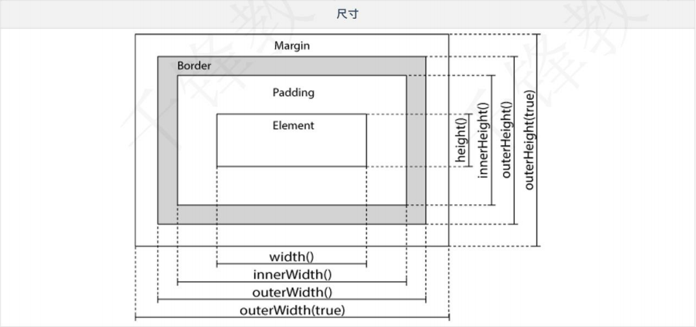

# Day33笔记

## 一、DOM--属性

### 1.1 概述

* 标签的属性是可以通过js代码设置的
* jq提供了便捷的方法操作属性

### 1.2 attr方法

* attr() 方法设置或返回被选元素的属性和值。
* 当该方法用于**返回**属性值，则返回第一个匹配元素的值。
* 当该方法用于**设置**属性值，则为匹配元素设置一个或多个属性/值对。

```html
<!DOCTYPE html>
<html>
	<head>
		<meta charset="utf-8">
		<title>获取属性</title>
		<script src="js/jquery-3.6.0.min.js" type="text/javascript" charset="utf-8"></script>
	</head>
	<body>
		<h3>木兰辞</h3>
		<h4>
			<a id="author" href="https://baike.baidu.com/item/%E4%BD%9A%E5%90%8D/37139?fr=aladdin">
				佚名
			</a>
		</h4>
		<p>唧唧复唧唧，木兰当户织</p>
		<button type="button" id="btn">获取作者链接</button>
		<button type="button" id="btn0">修改作者链接</button>
		<button type="button" id="btn00">添加title属性</button>
	</body>
	
	<script type="text/javascript">
		
		$("#btn").click(function(){
			console.log($("#author").attr("href"));
		});
		
		$("#btn0").click(function(){
			$("#author").attr("href","http://www.jd.com/");
		});
		
		$("#btn00").click(function(){
			$("#author").attr({
				"title":"百度一下你就知道",
				"target":"_blank"
			});
		});
		
	</script>
</html>
```

### 1.3 prop方法

* prop() 方法设置或返回被选元素的属性和值。
* 当该方法用于**返回**属性值时，则返回第一个匹配元素的值。
* 当该方法用于**设置**属性值时，则为匹配元素集合设置一个或多个属性/值对。

```html
<!DOCTYPE html>
<html>
	<head>
		<meta charset="utf-8">
		<title>属性操作</title>
		<script src="js/jquery-3.6.0.min.js" type="text/javascript" charset="utf-8"></script>
	</head>
	<body>
		<h3>木兰辞</h3>
		<h4>
			<a id="author" href="https://baike.baidu.com/item/%E4%BD%9A%E5%90%8D/37139?fr=aladdin">
				佚名
			</a>
		</h4>
		<p>唧唧复唧唧，木兰当户织</p>
		<input type="checkbox" id="ck"/>选中
		<hr >
		
		<button type="button" id="btn">获取作者链接</button>
		<button type="button" id="btn0">修改作者链接</button>
		<button type="button" id="btn00">选中复选框</button>
	</body>
	
	<script type="text/javascript">
		$("#btn").click(function(){
			console.log($("#author").prop("href"));
		});
		
		$("#btn0").click(function(){
			$("#author").prop("href","http://www.taobao.com/");
		});
		
		$("#btn00").click(function(){
			$("#ck").prop("checked","checked");
		});
	</script>
</html>
```

## 二、DOM--添加标签

### 2.1 添加的方法

* append() - 在被选元素的结尾插入内容
* prepend() - 在被选元素的开头插入内容
* after() - 在被选元素之后插入内容
* before() - 在被选元素之前插入内容

### 2.2 添加标签案例

```html
<!DOCTYPE html>
<html>
	<head>
		<meta charset="utf-8">
		<title>添加标签</title>
		
		<script src="js/jquery-3.6.0.min.js" type="text/javascript" charset="utf-8"></script>
		
		<style type="text/css">
			#box01{
				border: 1px solid red;
			}
		</style>
	</head>
	<body>
		<h3 id="title01">琵琶行</h3>
		<h4 id="author01">唐*白居易</h4>
		<div id="box01">
			<p id="con01" class="con">浔阳江头夜送客，枫叶荻花秋瑟瑟。</p>
			<p id="con02" class="con">主人下马客在船，举酒欲饮无管弦。</p>
			
			<p id="con03" class="con">醉不成欢惨将别，别时茫茫江浸月。</p>
			<p id="con04" class="con">忽闻水上琵琶声，主人忘归客不发。</p>
		</div>
		
		<button type="button" id="btn01">末尾添加一句Hello</button>
		<button type="button" id="btn02">头部添加一句World</button>
		<button type="button" id="btn03">中间添加一句HelloWorld</button>
		<button type="button" id="btn04">中间添加一句HelloJquery</button>
		
	</body>
	
	<script type="text/javascript">
		// 把内容添加到p的末尾
		$("#btn01").click(function(){
			$("#box01").append("<p>Hello</p>");
		});
		
		$("#btn02").click(function(){
			$("#box01").prepend("<p>World</p>");
		});
		
		$("#btn03").click(function(){
			$("#con02").after("<p>HelloWorld</p>");
		});
		
		$("#btn04").click(function(){
			$("#con03").before("<p>HelloJquery</p>");
		});
		
	</script>
	
</html>
```

## 三、DOM--删除

### 3.1 删除方法

* remove
* empty

### 3.2 删除案例

```html
<!DOCTYPE html>
<html>
	<head>
		<meta charset="utf-8">
		<title>删除元素</title>
		<script src="js/jquery-3.6.0.min.js" type="text/javascript" charset="utf-8"></script>
	</head>
	<body>
		<div id="box01">
			<ul id="book01">
				<li>西游记</li>
				<li>水浒传</li>
				<li>红楼梦</li>
				<li>三国演义</li>
			</ul>
			
			<ul id="book02">
				<li>平凡的世界</li>
				<li>花季雨季</li>
				<li>三体</li>
				<li>狂人日记</li>
			</ul>
		</div>
		
		<button type="button" id="btn01">删除所有</button>
		<button type="button" id="btn02">删除四大名著</button>
		<button type="button" id="btn03">清空四大名著</button>
	</body>
	
	<script type="text/javascript">
		$("#btn01").click(function(){
			$("#box01").remove();
		});
		
		$("#btn02").click(function(){
			$("ul").remove("#book01");
		});
		
		$("#btn03").click(function(){
			$("#book01").empty();
		});
		
	</script>
</html>
```

## 四、DOM--操作class属性

### 4.1 方法

* addClass() - 向被选元素添加一个或多个类
* removeClass() - 从被选元素删除一个或多个类
* toggleClass() - 对被选元素进行添加/删除类的切换操作

### 4.2 案例

```html
<!DOCTYPE html>
<html>
	<head>
		<meta charset="utf-8">
		<title>操作class</title>
		<script src="js/jquery-3.6.0.min.js" type="text/javascript" charset="utf-8"></script>
		
		<style type="text/css">
			.title{
				color: #FF0000;
			}
			
			.con-ji{
				color: blue;
				font-family: "仿宋";
			}
			
			.con-ou{
				background-color: antiquewhite;
			}
		</style>
		
	</head>
	<body>
		<!-- 
			国破山河在⑴，城春草木深⑵。
			感时花溅泪⑶，恨别鸟惊心⑷。
			烽火连三月⑸，家书抵万金⑹。
			白头搔更短⑺，浑欲不胜簪⑻。
		 -->
		<h3 id="title02">春望</h3>
		<p id="con01" class="con">国破山河在，城春草木深。</p>
		<p id="con02" class="con">感时花溅泪，恨别鸟惊心。</p>
		<p id="con03" class="con">烽火连三月，家书抵万金。</p>
		<p id="con04" class="con">白头搔更短，浑欲不胜簪。</p>
		
		<button type="button" id="btn01">修改标题颜色</button>
		<button type="button" id="btn04">还原标题颜色</button>
		<br>
		<button type="button" id="btn02">修改奇数行颜色</button>
		<button type="button" id="btn03">修改偶数行背景</button>
		<br>
		<button type="button" id="btn05">切换标题颜色</button>
		
	</body>
	
	<script type="text/javascript">
		
		$("#btn01").click(function(){
			$("#title02").addClass("title");
		});
		
		$("#btn02").click(function(){
			$("#con01").addClass("con-ji");
			$("#con03").addClass("con-ji");
		});
		
		$("#btn03").click(function(){
			$("#con02").addClass("con-ou");
			$("#con04").addClass("con-ou");
		});
		
		$("#btn04").click(function(){
			$("#title02").removeClass("title");
		});
		
		$("#btn05").click(function(){
			$("#title02").toggleClass("title");
		});
	</script>
</html>
```

## 五、DOM--css方法

### 5.1 方法

* css() 方法设置或返回被选元素的一个或多个样式属性。

* **返回 CSS 属性**

* 如需返回指定的 CSS 属性的值，请使用如下语法：
  * css("*propertyname*");
* **设置 CSS 属性**
* 如需设置指定的 CSS 属性，请使用如下语法：
  * css("*propertyname*","*value*");

* **设置多个 CSS 属性**

* 如需设置多个 CSS 属性，请使用如下语法：
  * css({"*propertyname*":"*value*","*propertyname*":"*value*",...});

### 5.2 案例

```html
<!DOCTYPE html>
<html>
	<head>
		<meta charset="utf-8">
		<title>css方法</title>
		<script src="js/jquery-3.6.0.min.js" type="text/javascript" charset="utf-8"></script>
		
		<style type="text/css">
			#title02{
				color: #0000FF;
				font-size: 32px;
			}
		</style>
		
	</head>
	<body>
		<h3 id="title02">春望</h3>
		<h4>唐*杜甫</h4>
		<p id="con01" class="con">国破山河在，城春草木深。</p>
		<p id="con02" class="con">感时花溅泪，恨别鸟惊心。</p>
		<p id="con03" class="con">烽火连三月，家书抵万金。</p>
		<p id="con04" class="con">白头搔更短，浑欲不胜簪。</p>
		
		<button type="button" id="btn01">获取标题属性</button>
		<button type="button" id="btn02">设置第一行属性</button>
		<button type="button" id="btn03">设置第二、三行属性</button>
		<button type="button" id="btn04">设置第四行属性</button>
	</body>
	
	<script type="text/javascript">
		
		$("#btn01").click(function(){
			console.log($("#title02").css("font-size"));
		});
		
		// 设置一条属性
		$("#btn02").click(function(){
			$("#con01").css("color","red");
		});
		
		// 设置多行属性
		$("#btn03").click(function(){
			$("#con02").css("color","blue");
			$("#con03").css("color","yellow");
		});
		
		
		// 设置多条属性
		$("#btn04").click(function(){
			$("#con04").css({
				"color":"red",
				"font-family":"仿宋"
			});
		});
		
	</script>
</html>
```

## 六、尺寸

### 6.1 方法

* **jQuery width() 和 height() 方法**
  * width() 方法设置或返回元素的宽度（不包括内边距、边框或外边距）。
  * height() 方法设置或返回元素的高度（不包括内边距、边框或外边距）。

* **jQuery innerWidth() 和 innerHeight() 方法**
  * innerWidth() 方法返回元素的宽度（包括内边距）。
  * innerHeight() 方法返回元素的高度（包括内边距）。

* **jQuery outerWidth() 和 outerHeight() 方法**

  * outerWidth() 方法返回元素的宽度（包括内边距和边框）。

  * outerHeight() 方法返回元素的高度（包括内边距和边框）

### 6.2 示例图



### 6.3 案例

```html
<!DOCTYPE html>
<html>
	<head>
		<meta charset="utf-8">
		<title>尺寸属性</title>
		<script src="js/jquery-3.6.0.min.js" type="text/javascript" charset="utf-8"></script>
		<style type="text/css">
			#box01{
				width: 200px;
				height: 200px;
				border: red solid 5px;
				padding-left: 100px;
				padding-top: 100px;
				margin-left: 30px;
			}
			
			#box02{
				width: 100px;
				height: 100px;
				border: blue solid 5px;
			}
			
		</style>
	</head>
	<body>
		<div id="box01">
			<div id="box02">
				
			</div>
		</div>
		
		<button type="button" id="btn01">获取原始宽和高</button>
		<button type="button" id="btn02">获取inner宽和高</button>
		<button type="button" id="btn03">获取outer宽和高</button>
		<button type="button" id="btn04">获取outer宽和高(true)</button>
		<button type="button" id="btn05">修改box02宽和高</button>
	</body>
	<script type="text/javascript">
		
		$("#btn01").click(function(){
			console.log("width:" + $("#box01").width());
			console.log("height:" + $("#box01").height());
		});
		
		$("#btn02").click(function(){
			console.log("innerWidth:" + $("#box01").innerWidth());
			console.log("innerHeight:" + $("#box01").innerHeight());
		});
		
		$("#btn03").click(function(){
			console.log("outerWidth:" + $("#box01").outerWidth());
			console.log("outerHeight:" + $("#box01").outerHeight());
		});
		
		$("#btn04").click(function(){
			console.log("outerWidth(true):" + $("#box01").outerWidth(true));
			console.log("outerHeight(true):" + $("#box01").outerHeight(true));
		});
		
		$("#btn05").click(function(){
			$("#box02").width("50px");
			$("#box02").height("50px");
		});
		
	</script>
</html>
```

## 七、遍历

### 7.1 概述

* jQuery 遍历，意为"移动"，用于根据其相对于其他元素的关系来"查找"（或选取）HTML 元素。
* 以某项选择开始，并沿着这个选择移动，直到抵达您期望的元素为止。

### 7.2 向上的方法

- parent()
- parents()
- parentsUntil()

```html
<!DOCTYPE html>
<html>
	<head>
		<meta charset="utf-8">
		<title>向上遍历</title>
		<script src="js/jquery-3.6.0.min.js" type="text/javascript" charset="utf-8"></script>
	</head>
	<body>
		<div id="box01">
			
			<ul id="wei">
				<li>曹操</li>
				<li>
					<a href="" id="sima">司马懿</a>
				</li>
				<li>曹丕</li>
				<li>曹植</li>
			</ul>
			
			<ul id="shu">
				<li>刘备</li>
				<li>
					<a href="">诸葛亮</a>
				</li>
				<li>关羽</li>
				<li>张飞</li>
			</ul>
			
			<ul id="wu">
				<li>孙坚</li>
				<li>
					<a href="">周瑜</a>
				</li>
				<li>孙策</li>
				<li>孙权</li>
			</ul>
		</div>
		
		<button type="button" id="btn01">直接父级</button>
		<button type="button" id="btn02">所有父级</button>
		<button type="button" id="btn03">区间父级</button>
		
	</body>
	<script type="text/javascript">
		
		$("#btn01").click(function(){
			console.log($("#sima").parent());
		});
		
		$("#btn02").click(function(){
			console.log($("#sima").parents());
		});
		
		$("#btn03").click(function(){
			console.log($("#sima").parentsUntil("body"));
		});
		
	</script>
</html>
```

### 7.3 向下的方法

- children()
- find()

```html
<!DOCTYPE html>
<html>
	<head>
		<meta charset="utf-8">
		<title></title>
		<script src="js/jquery-3.6.0.min.js" type="text/javascript" charset="utf-8"></script>
	</head>
	<body>
		<div id="box01">
			
			<ul id="wei">
				<li>曹操</li>
				<li>
					<a href="" id="sima">司马懿</a>
				</li>
				<li>曹丕</li>
				<li>曹植</li>
			</ul>
			
			<ul id="shu">
				<li>刘备</li>
				<li>
					<a href="">诸葛亮</a>
				</li>
				<li>关羽</li>
				<li>张飞</li>
			</ul>
			
			<ul id="wu">
				<li>孙坚</li>
				<li>
					<a href="">周瑜</a>
				</li>
				<li>孙策</li>
				<li>孙权</li>
			</ul>
		</div>
		
		<button type="button" id="btn01">直接子元素</button>
		<button type="button" id="btn02">所有子元素</button>
		<button type="button" id="btn03">直接shu子元素</button>
		<button type="button" id="btn04">所有a子元素</button>
	</body>
	
	<script type="text/javascript">
			
		$("#btn01").click(function(){
			console.log($("#box01").children());
		});
		
		$("#btn02").click(function(){
			console.log($("#box01").find("*"));
		});
		
		$("#btn03").click(function(){
			console.log($("#box01").children("ul#shu"));
		});
		
		$("#btn04").click(function(){
			console.log($("#box01").find("a"));
		});
	</script>
	
</html>
```

### 7.4 同胞的方法

- siblings()
- next()
- nextAll()
- nextUntil()
- prev()
- prevAll()
- prevUntil()

```html
<!DOCTYPE html>
<html>
	<head>
		<meta charset="utf-8">
		<title>同级遍历</title>
		<script src="js/jquery-3.6.0.min.js" type="text/javascript" charset="utf-8"></script>
	</head>
	<body>
		<div id="box01">
			
			<ul id="wei">
				<li id="caocao">曹操</li>
				<li>
					<a href="" id="sima">司马懿</a>
				</li>
				<li id="caopi">曹丕</li>
				<li id="caozhi">曹植</li>
				<p>曹爽</p>
			</ul>
			
			<ul id="shu">
				<li>刘备</li>
				<li>
					<a href="">诸葛亮</a>
				</li>
				<li>关羽</li>
				<li>张飞</li>
			</ul>
			
			<ul id="wu">
				<li>孙坚</li>
				<li>
					<a href="">周瑜</a>
				</li>
				<li>孙策</li>
				<li>孙权</li>
			</ul>
		</div>
		
		<button type="button" id="btn01">所有同级元素</button>
		<button type="button" id="btn02">下一个同胞元素</button>
		<button type="button" id="btn03">后面所有同胞元素</button>
		<button type="button" id="btn04">到曹植之间的同步元素</button>
	</body>
	
	<script type="text/javascript">
		$("#btn01").click(function(){
			console.log($("#caopi").siblings("li"));
		});
		
		$("#btn02").click(function(){
			console.log($("#caopi").next());
		});
		
		$("#btn03").click(function(){
			console.log($("#caopi").nextAll());
		});
		
		$("#btn04").click(function(){
			console.log($("#caocao").nextUntil("#caozhi"));
		});
	</script>
	
</html>
```

### 7.5 过滤

* first
* last
* eq
* filter
* not

```html
<!DOCTYPE html>
<html>
	<head>
		<meta charset="utf-8">
		<title></title>
		<script src="js/jquery-3.6.0.min.js" type="text/javascript" charset="utf-8"></script>
	</head>
	<body>
		<div id="box01">
			
			<ul id="wei">
				<li id="caocao" class="cao">曹操</li>
				<li class="sima">
					<a href="" id="sima">司马懿</a>
				</li>
				<li id="caopi" class="cao">曹丕</li>
				<li id="caozhi" class="cao">曹植</li>
				<p class="cao">曹爽</p>
			</ul>
		</div>
		
		<button type="button" id="btn01">第一个元素</button>
		<button type="button" id="btn02">最后一个元素</button>
		<button type="button" id="btn03">索引为2的元素</button>
		<button type="button" id="btn04">class为cao的元素</button>
		<button type="button" id="btn05">class不为cao的元素</button>
	</body>
	<script type="text/javascript">
		
		$("#btn01").click(function(){
			console.log($("li").first());
		});
		
		$("#btn02").click(function(){
			console.log($("li").last());
		});
		
		$("#btn03").click(function(){
			console.log($("li").eq(2));
		});
		
		$("#btn04").click(function(){
			console.log($("li").filter(".cao"));
		});
		
		$("#btn05").click(function(){
			console.log($("li").not(".cao"));
		});
		
	</script>
</html>
```

## 八、省市联动

### 8.1 js版

```html
<!DOCTYPE html>
<html>
	<head>
		<meta charset="utf-8">
		<title>省市联动</title>
	</head>
	<body>
		<select name="province" id="province" onchange="changeCity()">
			<option value="0">--省份--</option>
			<option value="1">--浙江省--</option>
			<option value="2">--江苏省--</option>
		</select>
		
		<select name="city" id="city">
			<option value="0">--地区--</option>
		</select>
	</body>
	
	<script type="text/javascript">
		// 创建二维数组,存储城市
		var cities = new Array();
		
		cities[1] = ["杭州市","宁波市","温州市","绍兴市","湖州市","嘉兴市","金华市","衢州市","台州市","舟山市","丽水市"];
		cities[2] = ["南京市","无锡市","徐州市","常州市","宿迁市","连云港市","盐城市","南通市","苏州市","淮安市","镇江市","扬州市"];
		
		function changeCity(){
			// 获取被选中的省份的value
			var proviceId = document.getElementById("province").value;
			console.log(cities[proviceId]);
			
			var city = document.getElementById("city");
			city.length = 1;
			
			// 遍历城市数组,创建option标签放入select
			
			for (var i = 0; i < cities[proviceId].length; i++) {
				var cityName = cities[proviceId][i];
				// 创建城市文本
				var cityNameNode = document.createTextNode(cityName);
				// 创建城市option
				var cityNameOption = document.createElement("option");
				// 把城市文本放入option
				cityNameOption.appendChild(cityNameNode);
				// 把城市放入城市select
				city.appendChild(cityNameOption);
			}
		}
		
	</script>
	
</html>
```

### 8.2 jq版

```html
<!DOCTYPE html>
<html>
	<head>
		<meta charset="utf-8">
		<script src="js/jquery-3.6.0.min.js" type="text/javascript" charset="utf-8"></script>
		<title>省市联动</title>
	</head>
	<body>
		<select name="province" id="province" onchange="changeCity()">
			<option value="0">--省份--</option>
			<option value="1">--浙江省--</option>
			<option value="2">--江苏省--</option>
		</select>
		
		<select name="city" id="city">
			<option value="0">--地区--</option>
		</select>
	</body>
	
	<script type="text/javascript">
		// 创建二维数组,存储城市
		var cities = new Array();
		
		cities[1] = ["杭州市","宁波市","温州市","绍兴市","湖州市","嘉兴市","金华市","衢州市","台州市","舟山市","丽水市"];
		cities[2] = ["南京市","无锡市","徐州市","常州市","宿迁市","连云港市","盐城市","南通市","苏州市","淮安市","镇江市","扬州市"];
		
		function changeCity(){
			// 获取被选中的省份的value
			var proviceId = $("#province").val();
			var city = $("#city");
			city.empty();
			
			// 遍历城市数组,创建option标签放入select
			for (var i = 0; i < cities[proviceId].length; i++) {
				var cityName = cities[proviceId][i];
				
				// 把城市放入城市select
				city.append("<option>"+cityName+"</option>");
			}
		}
		
	</script>
	
</html>
```

## 九、全选和不选

```html
<!DOCTYPE html>
<html>
	<head>
		<meta charset="utf-8">
		<title></title>
		<script src="js/jquery-3.6.0.min.js" type="text/javascript" charset="utf-8"></script>
	</head>
	<body>
		<div id="box">
			<div id="box-select">
				<input type="radio" name="selectBook" id="selectAll" value="" />全选
				<input type="radio" name="selectBook" id="selectNone" value="" />全不选
			</div>
			
			<hr >
			
			<div id="box-option">
				<input type="checkbox" class="book" id="" value="" />三国演义
				<br>
				<input type="checkbox" class="book" id="" value="" />水浒传
				<br>
				<input type="checkbox" class="book" id="" value="" />西游记
				<br>
				<input type="checkbox" class="book" id="" value="" />红楼梦
				<br>
			</div>
		</div>
	</body>
	
	<script type="text/javascript">
		// 全选
		$("#selectAll").on("click",function(){
			$(".book").prop("checked",true);
		});
		
		// 不选
		$("#selectNone").on("click",function(){
			$(".book").prop("checked",false);
		});
		
		$(".book").on("click",function(){
			// 获取所有的子选项
			var $books = $(".book");
			
			// 判断是否所有子选项都选中
			$("#selectAll").prop("checked",$books.length==$books.filter(":checked").length ? true:false);
		});
		
	</script>
	
</html>
```

