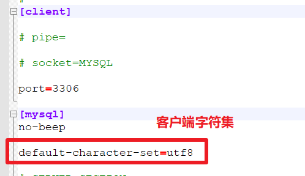
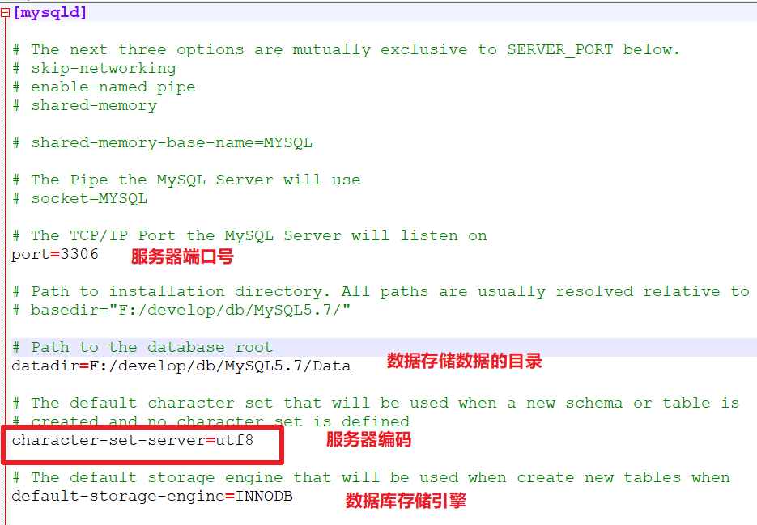
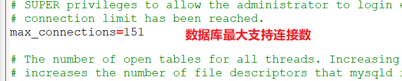

# 一、MySQL全局配置

- my.ini

## 1、文件路径

- MySQL默认安装
  - C:\ProgramData\MySQL\MySQL Server 5.7\my.ini

- 自定义安装
  - 安装路径下\my.ini

2、修改配置文件

| 修改配置文件                                                 |
| ------------------------------------------------------------ |
|  |
|  |
|  |

注意：==一定要重启mysql服务，才能生效==

- 管理员进入cmd
  - net stop mysql服务名
  - net start mysql服务名