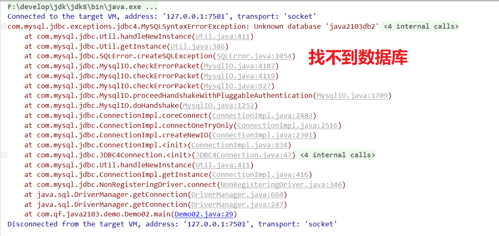

# 一、传统操作数据库的方式

## 1、命令行客户端连接数据库服务器

- cmd

## 2、图形化工具客户端连接数据库服务器

- SQLyog
- Navicat


## 3、问题

- 只能单纯的向数据库服务器发送SQL，不同SQL执行后得到不同的结果，只能展示在cmd窗口或者图形化工具的显示界面。而我们作为Java程序员，将来肯定是需要把数据展示给用户去看。不可能让用户去很复杂的操作，只需要让用户很简单的操作就可以得到想要的效果。最典型的，我们一般都是进行B/S开发，B指的是Brower，就是浏览器，所以用户只是通过浏览器来得到结果。


## 4、解决方案

### 4.1 如何从数据库中获取数据到我们的程序中?

- JDBC

### 4.2 如何把数据展示到浏览器上?

- JavaWEB


# 二、JDBC概述

## 1、简介

> 1. Java Database Connectivity：Java数据库连接技术
> 2. 是SUN公司提供一套操作数据库的接口。
>    1. 具体的实现已经由数据库厂商完成了
>    2. 我们要使用，只需要找对应的数据库厂商要JDBC接口的实现即可【JDBC数据库驱动】


## 2、工作原理

| 工作原理                                                     |
| ------------------------------------------------------------ |
|  |


## 3、JDBC核心接口

|   类型    | 权限定名               | 简介                                                         |
| :-------: | :--------------------- | :----------------------------------------------------------- |
|   class   | java.sql.DriverManager | 管理多个数据库驱动类，提供了获取数据库连接的方法             |
| interface | java.sql.Connection    | 代表一个数据库连接（当connection不是null时，表示已连接数据库） |
| interface | java.sql.Statement     | 发送SQL语句到数据库工具                                      |
| interface | java.sql.ResultSet     | 保存SQL查询语句的结果数据（结果集）                          |
|   class   | java.sql.SQLException  | 处理数据库应用程序时所发生的异常                             |


# 三、JDBC快速入门

## 1、实现步骤

> 1. 创建Java工程
> 2. 在项目根目录下创建一个lib目录，复制mysql驱动jar包到项目的lib目录，把jar编译到classpath下
> 3. 编写JDBC代码
>    1. 反射加载数据库驱动
>    2. 获取数据库连接Connection
>    3. 编写SQL
>    4. 获取执行SQL的载体对象Statement 
>    5. 处理结果
>    6. 释放资源
> 4. 测试

## 2、具体实现

| 增加jar包                                                    |
| ------------------------------------------------------------ |
|  |
|  |

- 编写JDBC代码

```mysql
package com.qf.java2103.demo;

import java.sql.Connection;
import java.sql.DriverManager;
import java.sql.SQLException;
import java.sql.Statement;

/**
 * @author ghy
 * @version 1.0
 */
public class Demo02 {

    public static void main(String[] args) {

        //选中代码，按 Ctrl+Alt+T ：就模版代码功能提示
        //哪里报红了，按 Alt+回车 ：有代码提示
        //代码写完了，可以在后面写.var，就会自动补全返回值
        Connection connection = null;
        Statement statement = null;

        try {
            //1. 反射加载数据库驱动
            Class.forName("com.mysql.jdbc.Driver");
            //2. 获取数据库连接Connection
            //url : 数据库表地址
            //user : 用户名
            //password : 密码
            connection = DriverManager.getConnection("jdbc:mysql://localhost:3306/java2103db", "root", "root");
            //3. 编写SQL【这个SQL一定要去SQLyog中写】
            String sql = "INSERT INTO tb_user (`username`,`password`,`gender`,`birthday`,`create_time`,`balance`) \n" +
                    "VALUES ('lucy', '123123', '0', '2001-12-12', NOW(), 6000.6)";
            //4. 获取执行SQL的载体对象Statement
            statement = connection.createStatement();
            //5. 执行SQL，处理结果
            int count = statement.executeUpdate(sql);
            System.out.println("count = " + count);
        } catch (ClassNotFoundException e) {
            e.printStackTrace();
        } catch (SQLException e) {
            e.printStackTrace();
        } finally {
            //6. 释放资源。先开后关
            try {
                if(null != statement) {
                    statement.close();
                }
            } catch (SQLException e) {
                e.printStackTrace();
            }
            try {
                if(null != connection) {
                    connection.close();
                }
            } catch (SQLException e) {
                e.printStackTrace();
            }
        }

    }
}
```


## 3、JDBC操作中常见错误

| 常见错误                                                     |
| ------------------------------------------------------------ |
|  |
|  |
|  |
|  |


## 4、查询

```java
package com.qf.java2103.demo;

import java.sql.*;
import java.util.ConcurrentModificationException;

/**
 * @author ghy
 * @version 1.0
 */
public class Demo05Select {
    public static void main(String[] args) {

        Connection connection = null;
        Statement statement = null;
        ResultSet resultSet = null;
        try {
            Class.forName("com.mysql.jdbc.Driver");
            connection = DriverManager.getConnection("jdbc:mysql:///java2103db", "root", "root");
            statement = connection.createStatement();
            String sql = "SELECT user_id uid,username,password,gender,birthday,create_time,balance FROM tb_user";
            resultSet = statement.executeQuery(sql);
            // 查询后得到一个结果集。
            // 处理结果
            while (resultSet.next()) {  //判断是否有下一行数据
                //通过结果集列名来获取对应的数据
                int userId = resultSet.getInt("uid");
                String username = resultSet.getString("username");
                String password = resultSet.getString("password");
                String gender = resultSet.getString("gender");
                Date date = resultSet.getDate("birthday");
                Timestamp createTime = resultSet.getTimestamp("create_time");
                double balance = resultSet.getDouble("balance");
                System.out.println(userId + "  " + username + "  " + password + "  " + gender + "  " + date + "  " + createTime + "  " + balance);
            }
        } catch (ClassNotFoundException e) {
            e.printStackTrace();
        } catch (SQLException e) {
            e.printStackTrace();
        } finally {
            try {
                if(null != resultSet) {
                    resultSet.close();
                }
            } catch (SQLException e) {
                e.printStackTrace();
            }
            try {
                if(null != statement) {
                    statement.close();
                }
            } catch (SQLException e) {
                e.printStackTrace();
            }
            try {
                if(null != connection) {
                    connection.close();
                }
            } catch (SQLException e) {
                e.printStackTrace();
            }
        }

    }
}
```

