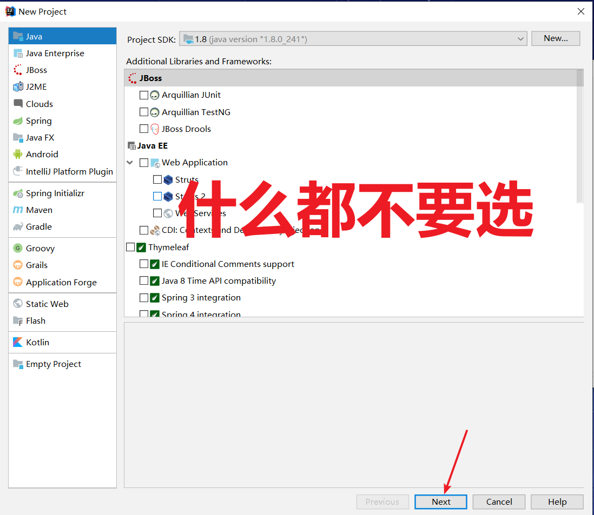
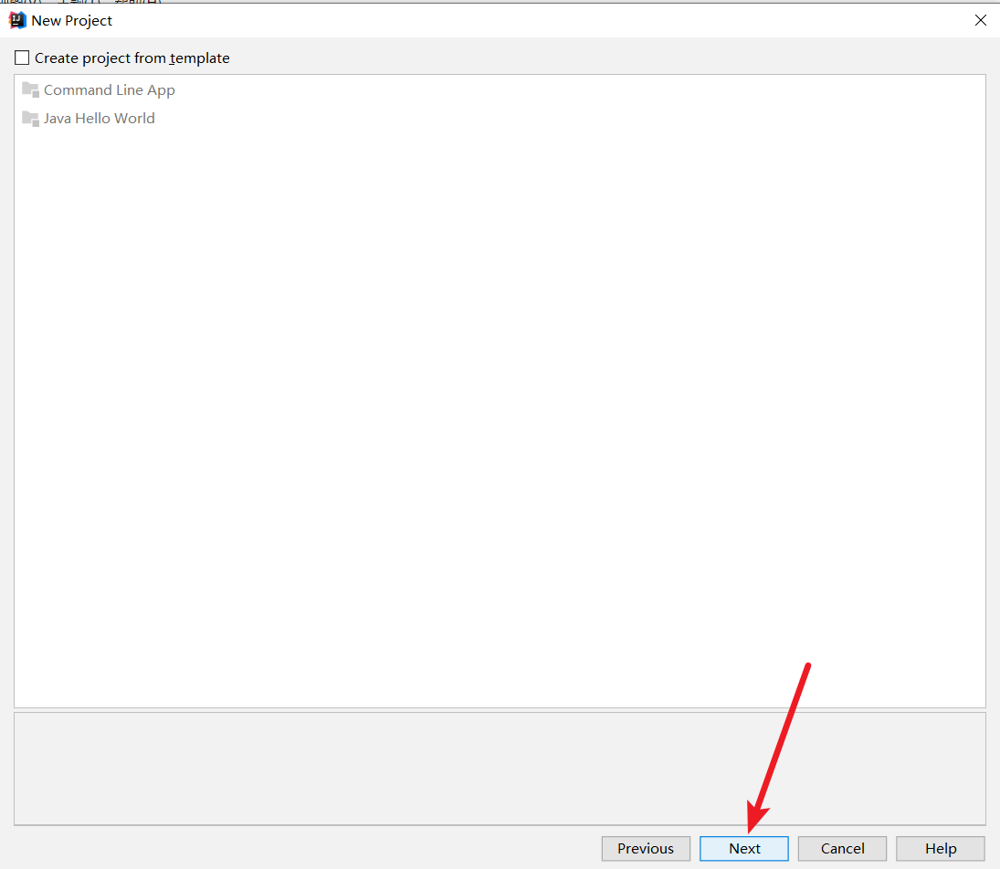
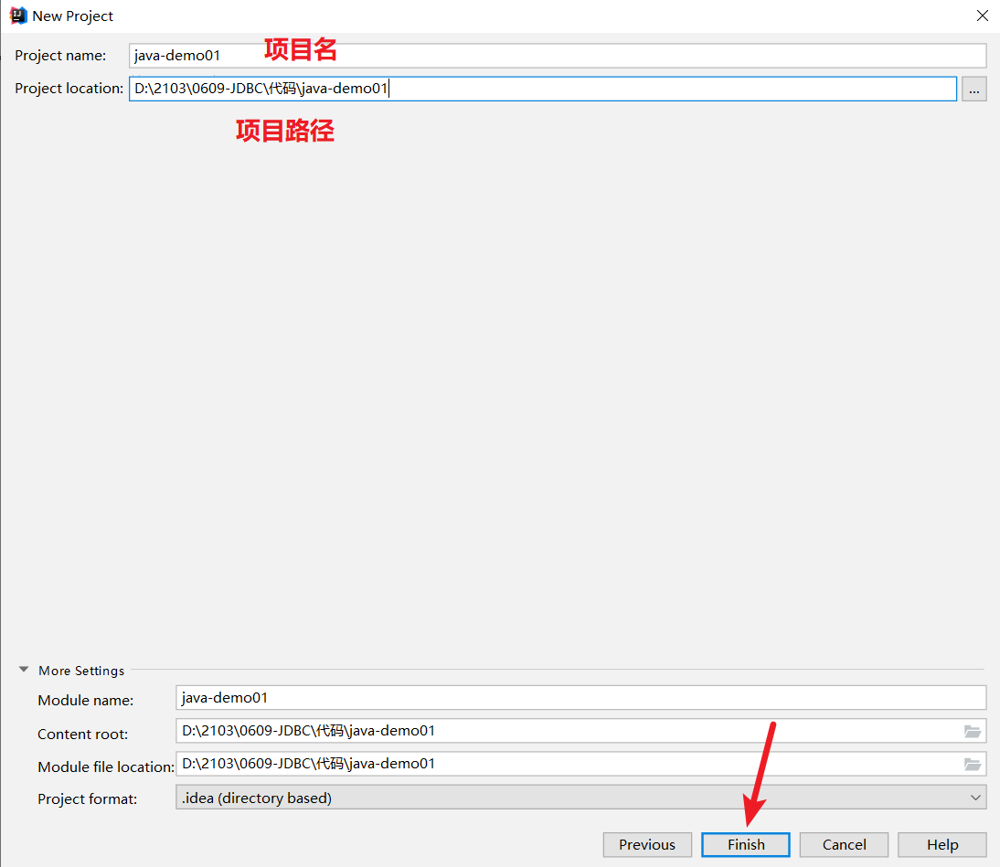
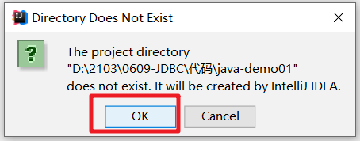
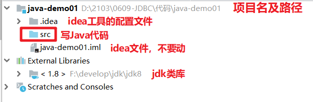
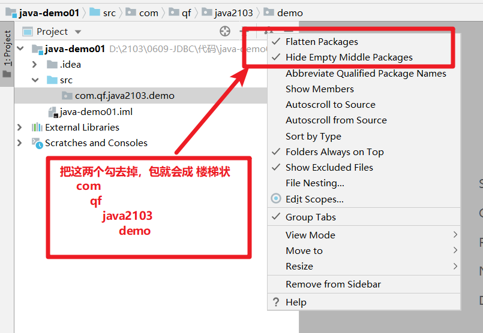
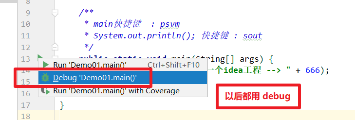

# 一、普通Java工程

## 1、创建普通Java工程

| 创建普通Java工程                                             |
| ------------------------------------------------------------ |
|  |
|  |
|  |
|  |

## 2、工程结构

| 工程结构                                                     |
| ------------------------------------------------------------ |
|  |
|  |

| 执行main方法                                                 |
| ------------------------------------------------------------ |
|  |

