# 一、传统操作数据库的方式

## 1、命令行客户端连接数据库服务器

- cmd

## 2、图形化工具客户端连接数据库服务器

- SQLyog
- Navicat


## 3、问题

- 只能单纯的向数据库服务器发送SQL，不同SQL执行后得到不同的结果，只能展示在cmd窗口或者图形化工具的显示界面。而我们作为Java程序员，将来肯定是需要把数据展示给用户去看。不可能让用户去很复杂的操作，只需要让用户很简单的操作就可以得到想要的效果。最典型的，我们一般都是进行B/S开发，B指的是Brower，就是浏览器，所以用户只是通过浏览器来得到结果。


## 4、解决方案

### 4.1 如何从数据库中获取数据到我们的程序中?

- JDBC

### 4.2 如何把数据展示到浏览器上?

- JavaWEB


# 二、JDBC概述

## 1、简介

> 1. Java Database Connectivity：Java数据库连接技术
> 2. 是SUN公司提供一套操作数据库的接口。
>    1. 具体的实现已经由数据库厂商完成了
>    2. 我们要使用，只需要找对应的数据库厂商要JDBC接口的实现即可【JDBC数据库驱动】


## 2、工作原理

| 工作原理                                                     |
| ------------------------------------------------------------ |
| 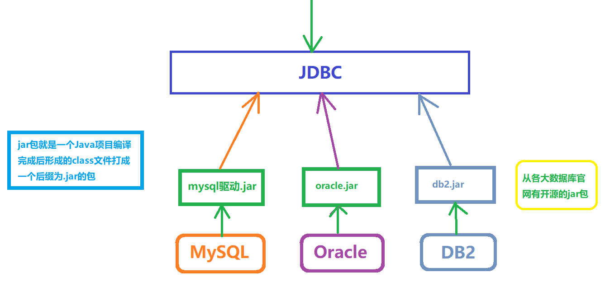 |


## 3、JDBC核心接口

|   类型    | 权限定名               | 简介                                                         |
| :-------: | :--------------------- | :----------------------------------------------------------- |
|   class   | java.sql.DriverManager | 管理多个数据库驱动类，提供了获取数据库连接的方法             |
| interface | java.sql.Connection    | 代表一个数据库连接（当connection不是null时，表示已连接数据库） |
| interface | java.sql.Statement     | 发送SQL语句到数据库工具                                      |
| interface | java.sql.ResultSet     | 保存SQL查询语句的结果数据（结果集）                          |
|   class   | java.sql.SQLException  | 处理数据库应用程序时所发生的异常                             |


# 三、JDBC快速入门

## 1、实现步骤

> 1. 创建Java工程
> 2. 在项目根目录下创建一个lib目录，复制mysql驱动jar包到项目的lib目录，把jar编译到classpath下
> 3. 编写JDBC代码
>    1. 反射加载数据库驱动
>    2. 获取数据库连接Connection
>    3. 编写SQL
>    4. 获取执行SQL的载体对象Statement 
>    5. 处理结果
>    6. 释放资源
> 4. 测试

## 2、具体实现

| 增加jar包                                                    |
| ------------------------------------------------------------ |
| 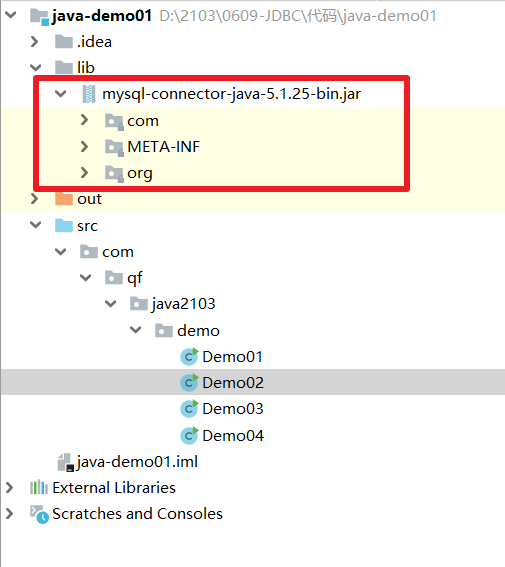 |
| 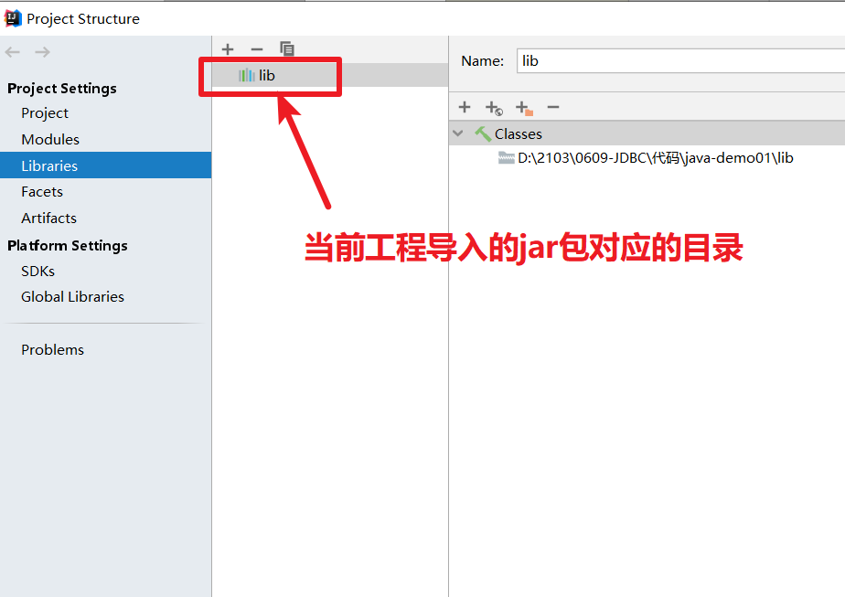 |

- 编写JDBC代码

```mysql
package com.qf.java2103.demo;

import java.sql.Connection;
import java.sql.DriverManager;
import java.sql.SQLException;
import java.sql.Statement;

/**
 * @author ghy
 * @version 1.0
 */
public class Demo02 {

    public static void main(String[] args) {

        //选中代码，按 Ctrl+Alt+T ：就模版代码功能提示
        //哪里报红了，按 Alt+回车 ：有代码提示
        //代码写完了，可以在后面写.var，就会自动补全返回值
        Connection connection = null;
        Statement statement = null;

        try {
            //1. 反射加载数据库驱动
            Class.forName("com.mysql.jdbc.Driver");
            //2. 获取数据库连接Connection
            //url : 数据库表地址
            //user : 用户名
            //password : 密码
            connection = DriverManager.getConnection("jdbc:mysql://localhost:3306/java2103db", "root", "root");
            //3. 编写SQL【这个SQL一定要去SQLyog中写】
            String sql = "INSERT INTO tb_user (`username`,`password`,`gender`,`birthday`,`create_time`,`balance`) \n" +
                    "VALUES ('lucy', '123123', '0', '2001-12-12', NOW(), 6000.6)";
            //4. 获取执行SQL的载体对象Statement
            statement = connection.createStatement();
            //5. 执行SQL，处理结果
            int count = statement.executeUpdate(sql);
            System.out.println("count = " + count);
        } catch (ClassNotFoundException e) {
            e.printStackTrace();
        } catch (SQLException e) {
            e.printStackTrace();
        } finally {
            //6. 释放资源。先开后关
            try {
                if(null != statement) {
                    statement.close();
                }
            } catch (SQLException e) {
                e.printStackTrace();
            }
            try {
                if(null != connection) {
                    connection.close();
                }
            } catch (SQLException e) {
                e.printStackTrace();
            }
        }

    }
}
```


## 3、JDBC操作中常见错误

| 常见错误                                                     |
| ------------------------------------------------------------ |
| 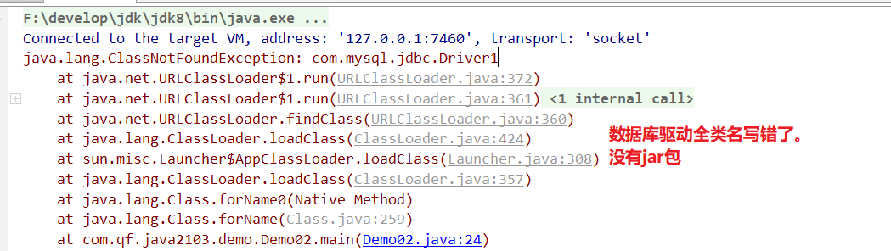 |
| 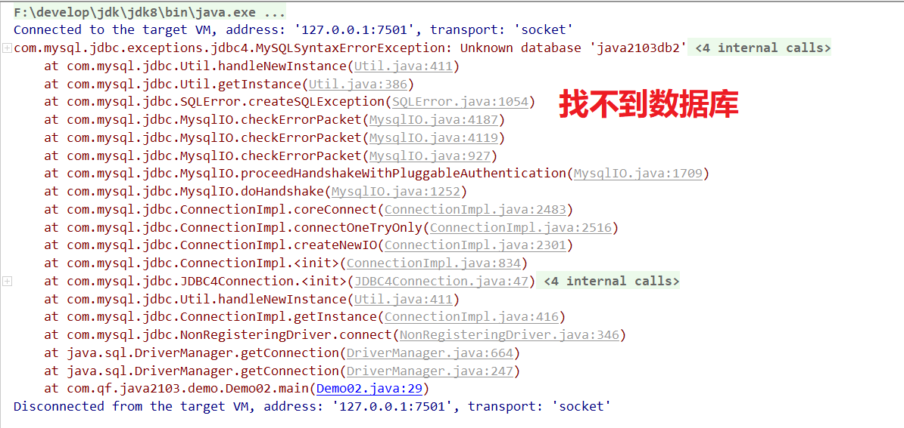 |
| 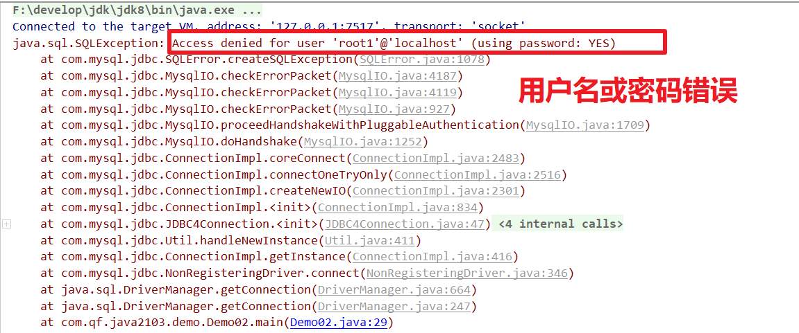 |
|  |


## 4、查询

```java
package com.qf.java2103.demo;

import java.sql.*;
import java.util.ConcurrentModificationException;

/**
 * @author ghy
 * @version 1.0
 */
public class Demo05Select {
    public static void main(String[] args) {

        Connection connection = null;
        Statement statement = null;
        ResultSet resultSet = null;
        try {
            Class.forName("com.mysql.jdbc.Driver");
            connection = DriverManager.getConnection("jdbc:mysql:///java2103db", "root", "root");
            statement = connection.createStatement();
            String sql = "SELECT user_id uid,username,password,gender,birthday,create_time,balance FROM tb_user";
            resultSet = statement.executeQuery(sql);
            // 查询后得到一个结果集。
            // 处理结果
            while (resultSet.next()) {  //判断是否有下一行数据
                //通过结果集列名来获取对应的数据
                int userId = resultSet.getInt("uid");
                String username = resultSet.getString("username");
                String password = resultSet.getString("password");
                String gender = resultSet.getString("gender");
                Date date = resultSet.getDate("birthday");
                Timestamp createTime = resultSet.getTimestamp("create_time");
                double balance = resultSet.getDouble("balance");
                System.out.println(userId + "  " + username + "  " + password + "  " + gender + "  " + date + "  " + createTime + "  " + balance);
            }
        } catch (ClassNotFoundException e) {
            e.printStackTrace();
        } catch (SQLException e) {
            e.printStackTrace();
        } finally {
            try {
                if(null != resultSet) {
                    resultSet.close();
                }
            } catch (SQLException e) {
                e.printStackTrace();
            }
            try {
                if(null != statement) {
                    statement.close();
                }
            } catch (SQLException e) {
                e.printStackTrace();
            }
            try {
                if(null != connection) {
                    connection.close();
                }
            } catch (SQLException e) {
                e.printStackTrace();
            }
        }

    }
}
```


# 四、SQL注入问题

## 1、登录案例

| 登录案例                                                     |
| ------------------------------------------------------------ |
| 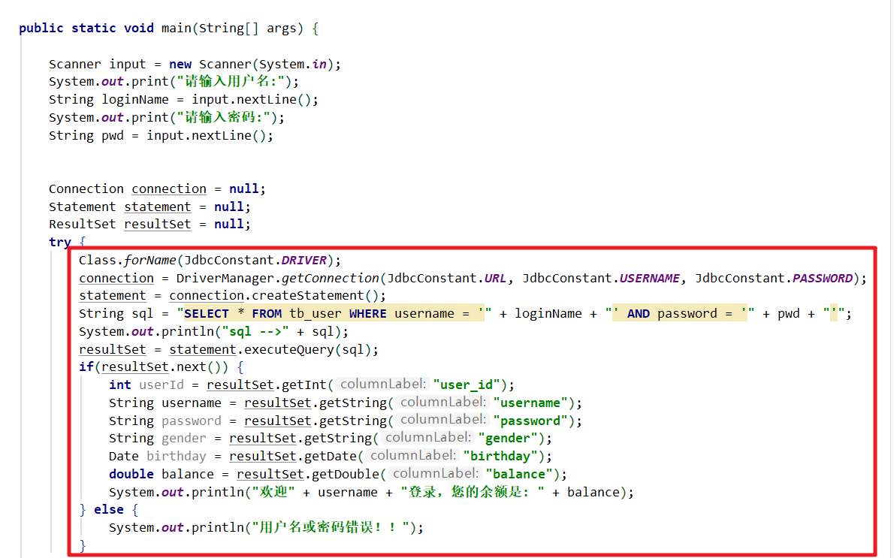 |


## 2、演示SQL注入

| 演示SQL注入                                                  |
| ------------------------------------------------------------ |
| 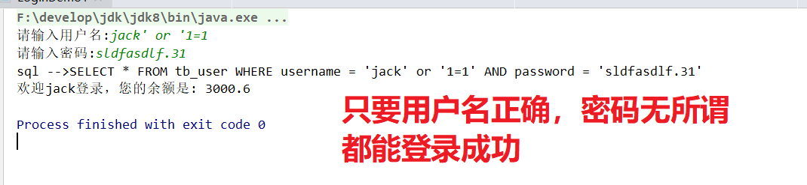 |

### 2.1 原因

- 因为SQL是通过字符串拼接的方式生成的，并没有对其语法进行校验

### 2.2 解决方案

- 校验SQL：预编译SQL【使用PreparedStatement接口】


## 3、PreparedStatement

### 3.1 原理

- 会在填充完占位符之后，对传入的数据中的特殊字符进行转义，还原成其原本的意义，所以在SQL拼接时不会出现歧义，保证SQL的正确性

| 原理                                                         |
| ------------------------------------------------------------ |
|  |


### 3.2 优化登录案例

| 优化登录案例                                                 |
| ------------------------------------------------------------ |
| 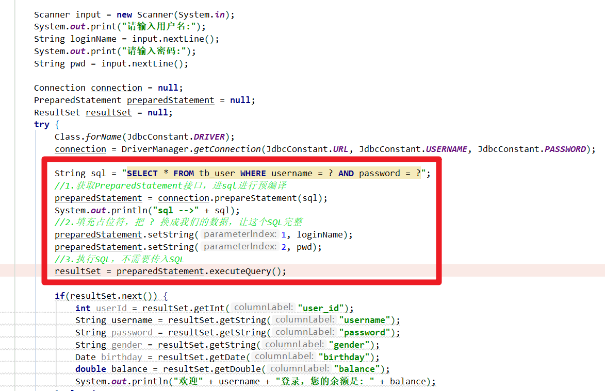 |

### 3.3 注意事项

- 填充占位符时，索引从1开始

- 在获取结果集的数据时，也可以通过结果集列索引来获取，索引从1开始


## 4、使用PreparedStatement完成增删改

4.1 根据ID删除

4.2 增加

> 参考demo包

# 五、抽取工具类

## 1、第一版

- 工具类

```java
package com.qf.java2103.utils;

import com.qf.java2103.constant.JdbcConstant;

import java.sql.*;

/**
 * @author ghy
 * @version 1.0
 */
public class JdbcUtils {

    /**
     * 加载驱动只需要执行一次即可
     */
    static {
        try {
            Class.forName(JdbcConstant.DRIVER);
        } catch (ClassNotFoundException e) {
            e.printStackTrace();
        }
    }

    /**
     * 获取Connection
     * @return
     */
    public static Connection getConnection(){
        try {
            Connection connection = DriverManager.getConnection(JdbcConstant.URL,JdbcConstant.USERNAME, JdbcConstant.PASSWORD);
            return connection;
        } catch (SQLException e) {
            e.printStackTrace();
        }
        return null;
    }

    /**
     * 释放资源
     * @param resultSet
     * @param statement
     * @param connection
     */
    public static void release(ResultSet resultSet, Statement statement, Connection connection){
        try {
            if(null != resultSet) {
                resultSet.close();
            }
        } catch (SQLException e) {
            e.printStackTrace();
        }
        try {
            if(null != statement) {
                statement.close();
            }
        } catch (SQLException e) {
            e.printStackTrace();
        }
        try {
            if(null != connection) {
                connection.close();
            }
        } catch (SQLException e) {
            e.printStackTrace();
        }
    }

}
```

- 删除代码修改

| 删除代码修改                                                 |
| ------------------------------------------------------------ |
| 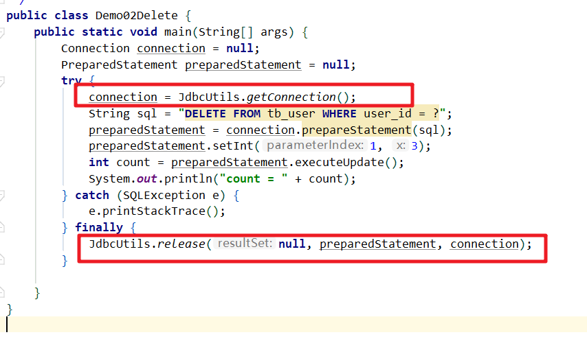 |


## 2、第二版

- jdbc.properties
  - src下

```properties
jdbc.driver=com.mysql.jdbc.Driver
#serverTimezone=GMT #时区
#characterEncoding=UTF8  #编码格式
jdbc.url=jdbc:mysql://localhost:3306/java2103db?useSSL=false&serverTimezone=GMT&characterEncoding=UTF8&useUnicode=true
jdbc.username=root
jdbc.password=root
```

- 工具类

```java
package com.qf.java2103.utils;

import com.qf.java2103.constant.JdbcConstant;

import java.io.IOException;
import java.io.InputStream;
import java.sql.*;
import java.util.Properties;

/**
 * @author ghy
 * @version 1.0
 */
public class JdbcUtils {

    private static final Properties PROPERTIES = new Properties();
    /**
     * 加载驱动只需要执行一次即可
     */
    static {
        InputStream in = null;
        try {
            in = JdbcUtils.class.getClassLoader().getResourceAsStream("jdbc.properties");
            PROPERTIES.load(in);
            Class.forName(PROPERTIES.getProperty("jdbc.driver"));
        } catch (Exception e) {
            e.printStackTrace();
        } finally {
            try {
                if(null != in) {
                    in.close();
                }
            } catch (Exception e) {
                e.printStackTrace();
            }
        }
    }

    /**
     * 获取Connection
     * @return
     */
    public static Connection getConnection(){
        try {
            Connection connection = DriverManager.getConnection(PROPERTIES.getProperty("jdbc.url"),
                    PROPERTIES.getProperty("jdbc.username"),
                    PROPERTIES.getProperty("jdbc.password"));
            return connection;
        } catch (SQLException e) {
            e.printStackTrace();
        }
        return null;
    }

    /**
     * 释放资源
     * @param resultSet
     * @param statement
     * @param connection
     */
    public static void release(ResultSet resultSet, Statement statement, Connection connection){
        try {
            if(null != resultSet) {
                resultSet.close();
            }
        } catch (SQLException e) {
            e.printStackTrace();
        }
        try {
            if(null != statement) {
                statement.close();
            }
        } catch (SQLException e) {
            e.printStackTrace();
        }
        try {
            if(null != connection) {
                connection.close();
            }
        } catch (SQLException e) {
            e.printStackTrace();
        }
    }

}
```


## 3、第三版

- JdbcUtils加一个方法

```java
/**
 * 公共增删改方法
 * @param sql 执行的SQL
 * @param params : 要给?填充值的列表   ('aa','bb')
 * @return
 */
public static int commonUpdate(String sql, Object ... params){
    PreparedStatement preparedStatement = null;
    try {
        preparedStatement = getConnection().prepareStatement(sql);
        if(null != params) {
            for (int i = 0; i < params.length; i++) {
                preparedStatement.setObject(i+1, params[i]);
            }
        }
        return preparedStatement.executeUpdate();
    } catch (SQLException e) {
        e.printStackTrace();
    } finally {
        release(null, preparedStatement, null);
    }
    return 0;
}

```


# 六、ORM

## 1、概述

- 一种把数据库表跟Java实体类形成关系的思想
  - 对象关系映射【Object Relational Mapping】

## 2、映射规则

- 数据库下划线+后面的字母 --->   Java中的大写字母
  - user_id     ---> userId
  - 表名   tb_user    --->  TbUser【User】

| 数据库表   | Java实体类 |
| ---------- | ---------- |
| 表名       | 类名       |
| 列【字段】 | 属性名     |
| 行【记录】 | 对象       |

| ORM映射                                                      |
| ------------------------------------------------------------ |
| 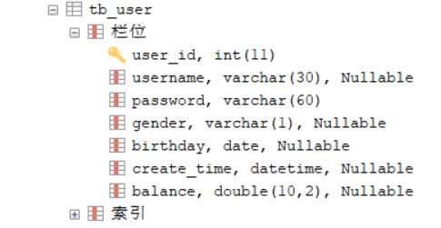 |
| 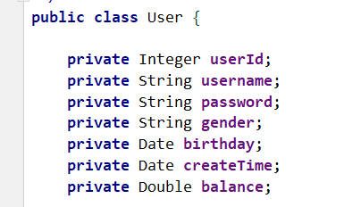 |

## 3、细节点

### 3.1 属性与成员变量

譬如上面的User中userId

- 成员变量 是 userId
- 属性是 getter/setter 方法去掉 get/set后，后面那部分首字母改成小写

### 3.2 在定义变量时，不要第一个字母小写，第二个字母大写

- 譬如：uId，很可能将来在取值或设置值会失败，甚至报错，可以写 uid

### 3.3 JavaBean

- 是Java语言对特殊的POJO的一种叫法
  - 无参构造器 + 封装  -->   JavaBean


# 七、DAO

## 1、概述

- Data Access Object
- 数据访问层

## 2、作用

- 交互数据库
- Dao中的一个方法尽量负责完成一个SQL的功能
- 尽量让Dao中的方法职责单一

## 3、编写一个UserDao

### 3.1 命名

- 实体类名Dao
- I实体类名Dao    （接口）

### 3.2 层次

- 一般都有接口和实现，为了扩展

### 3.3 具体实现

- Dao接口

```java
package com.qf.java2103.dao;

import com.qf.java2103.pojo.User;

import java.util.List;

/**
 * 用户持久层接口
 * @author ghy
 * @version 1.0
 */
public interface IUserDao {

    //List<User> selectList();
    //List<User> queryAll();
    //List<User> searchAll();

    /**
     * 查询所有
     * @return
     */
    List<User> findAll();

    /**
     * 根据ID查询
     * @param id 对应数据库主键
     * @return
     */
    User findById(Integer id);

    /**
     * 保存
     * @param user
     * @return
     */
    int save(User user);

    /**
     * 修改
     * @param user
     * @return
     */
    int modify(User user);

    /**
     * 删除
     * @param id
     * @return
     */
    int deleteById(Integer id);


}

```

- UserDaoImpl实现类

```java
package com.qf.java2103.dao.impl;

import com.qf.java2103.dao.IUserDao;
import com.qf.java2103.pojo.User;
import com.qf.java2103.utils.JdbcUtils;

import java.sql.*;
import java.util.ArrayList;
import java.util.List;

/**
 * @author ghy
 * @version 1.0
 */
public class UserDaoImpl implements IUserDao {
    @Override
    public List<User> findAll() {
        List<User> users = new ArrayList<>();

        Connection connection = JdbcUtils.getConnection();
        PreparedStatement preparedStatement = null;
        ResultSet resultSet = null;
        try {
            String sql = "SELECT user_id uid,username,password,gender,birthday,create_time,balance FROM tb_user";
            preparedStatement = connection.prepareStatement(sql);
            resultSet = preparedStatement.executeQuery();
            while (resultSet.next()) {
                int uid = resultSet.getInt("uid");
                String username = resultSet.getString("username");
                String password = resultSet.getString("password");
                String gender = resultSet.getString("gender");
                Date birthday = resultSet.getDate("birthday");
                Timestamp createTime = resultSet.getTimestamp("create_time");
                double balance = resultSet.getDouble("balance");
                User user = new User(uid, username, password, gender, birthday, createTime, balance);
                users.add(user);
            }
        } catch (SQLException e) {
            e.printStackTrace();
        } finally {
            JdbcUtils.release(resultSet, preparedStatement, connection);
        }
        return users;
    }

    @Override
    public User findById(Integer id) {
        Connection connection = JdbcUtils.getConnection();
        PreparedStatement preparedStatement = null;
        ResultSet resultSet = null;
        try {
            String sql = "SELECT user_id uid,username,password,gender,birthday,create_time,balance FROM tb_user WHERE user_id = ?";
            preparedStatement = connection.prepareStatement(sql);
            preparedStatement.setInt(1, id);
            resultSet = preparedStatement.executeQuery();
            if (resultSet.next()) {
                int uid = resultSet.getInt("uid");
                String username = resultSet.getString("username");
                String password = resultSet.getString("password");
                String gender = resultSet.getString("gender");
                Date birthday = resultSet.getDate("birthday");
                Timestamp createTime = resultSet.getTimestamp("create_time");
                double balance = resultSet.getDouble("balance");
                return new User(uid, username, password, gender, birthday, createTime, balance);
            }
        } catch (SQLException e) {
            e.printStackTrace();
        } finally {
            JdbcUtils.release(resultSet, preparedStatement, connection);
        }
        return null;
    }

    @Override
    public int save(User user) {
        return 0;
    }

    @Override
    public int modify(User user) {
        String sql = "UPDATE tb_user SET username = ?, PASSWORD = ?, gender = ?, birthday = ?, balance = ? WHERE user_id = ?";
        return JdbcUtils.commonUpdate(sql,
                user.getUsername(), user.getPassword(), user.getGender(),
                user.getBirthday(),user.getBalance(), user.getUserId());
    }

    @Override
    public int deleteById(Integer id) {
        return 0;
    }
}

```


# 八、Junit单元测试

## 1、使用步骤

> 1. 导入jar包【可以使用idea工具自带的junit.jar】
> 2. 写测试方法
>    1. 方法名：xxxTest   --->  findAllTest
>    2. 在方法上标记一个注解@Test
> 3. 运行

## 2、单元测试方法的规范

```java
@Test
public void xxxTest() [throws Exception] {   
    // 测试代码
}
```

```java
@Test
public void findAllTest(){
    IUserDao userDao = new UserDaoImpl();
    List<User> users = userDao.findAll();
    for (User user : users) {
        System.out.println(user);
    }
}

/**
 * 测试根据ID查询
 * @throws Exception
 */
@Test
public void findByIdTest() throws Exception {
    IUserDao userDao = new UserDaoImpl();
    User user = userDao.findById(3);
    System.out.println("user = " + user);
}

/**
 * 修改
 * @throws Exception
 */
@Test
public void modifyTest() throws Exception {
    IUserDao userDao = new UserDaoImpl();
    User user = userDao.findById(3);
    System.out.println("update before = " + user);

    user.setPassword("123456789");
    int count = userDao.modify(user);
    System.out.println("count = " + count);

}
```


## 3、@Before和@After

- @Before标记在方法上，这个方法会在@Test标记的方法之前运行
- @After标记在方法上，这个方法会在@Test标记的方法之后运行

```java
@Before
public void init(){
    System.out.println("我是before。。。。");
}

@After
public void destroy(){
    System.out.println("我是after。。。。");
}
```


## 4、注意点

- idea的单元测试不兼容Scanner


作业

1、完成UserDao

2、完成AccountDao


邮箱：1017547987@qq.com

- 作业名称：java2103-张三.rar       java2103-张三.zip


