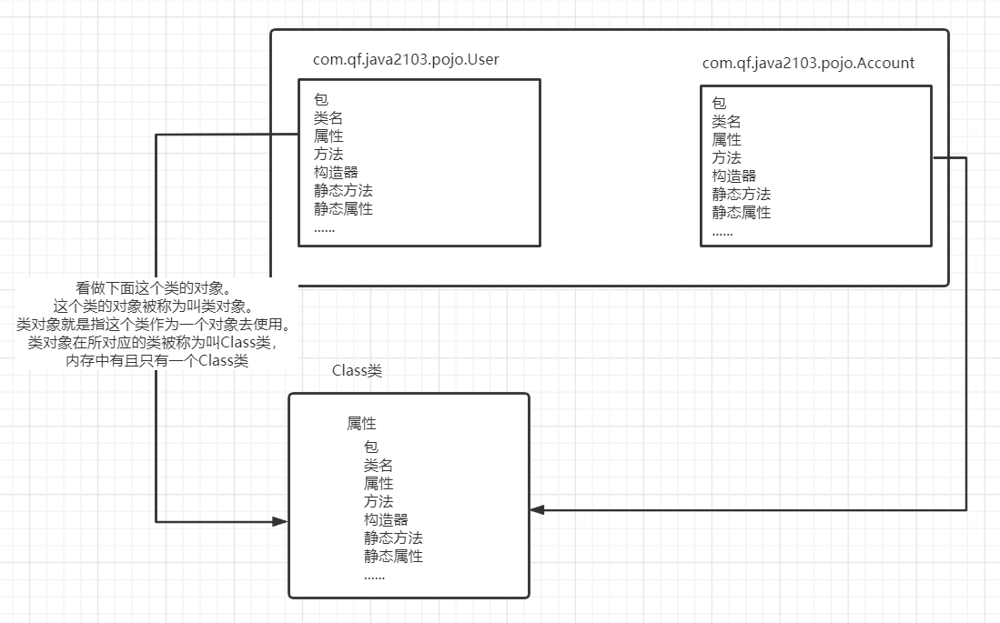
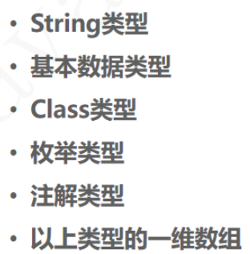

# 一、类对象

| 类对象                                                       |
| ------------------------------------------------------------ |
|  |


# 二、获取类对象的方法

```java
/**
 * 获取类对象
 * @throws Exception
 */
@Test
public void getClassTest() throws Exception {
    //1.先获得类的对象，通过对象.getClass获取类对象
    User user = new User();
    Class<? extends User> clazz1 = user.getClass();
    System.out.println("clazz1 = " + clazz1);

    //2.通过类名.class获取类对象
    Class<User> clazz2 = User.class;
    System.out.println("clazz2 = " + clazz2);

    //3.使用Class的静态方法.forName
    Class<?> clazz3 = Class.forName("com.qf.java2103.pojo.User");
    System.out.println("clazz3 = " + clazz3);

    System.out.println(clazz1 == clazz2);
    System.out.println(clazz2 == clazz3);
    System.out.println(clazz1 == clazz3);

    //强烈推荐第3种。因为第1种跟第2种都需要User类存在才能编译通过

}
```


# 三、通过反射获取类信息

## 3.1 获取类名

- clazz.getName()

## 3.2 获取类加载器

- clazz.getClassLoader()

## 3.2 获取构造器

- 获取公开的
  - clazz.getConstructors()：获取全部的公开构造器
  - clazz.getConstructor(Class ... params)：通过指定参数类型来获取对应公开的构造器
- 获取全部的
  - clazz.getDeclaredConstructors()：获取全部构造器【包括非公开的】
  - clazz.getDeclaredConstructor(Class ... params)：通过指定参数类型来获取对应的构造器

## 3.3 反射创建对象

- clazz.newInstance()：调用无参构造器反射创建对象
- clazz.newInstance(Object ... params)：调用指定参数的构造器反射创建对象
  - 如果构造器是私有的，那么请在调用newInstance之前设置访问权限
    - 构造器对象.setAccessible(true);

```
/**
 * 通过Class对象获取类的信息
 * @throws Exception
 */
@Test
public void clazzGetInfoTest() throws Exception {

    Class<?> clazz = Class.forName("com.qf.java2103.pojo.User");
    //1.全限定类名【包名.类名】
    //String name = clazz.getName();
    //System.out.println("name = " + name);
    ////2.类名
    //String simpleName = clazz.getSimpleName();
    //System.out.println("simpleName = " + simpleName);
//
    ////3.获取类加载器
    //ClassLoader classLoader = clazz.getClassLoader();
    //System.out.println("classLoader = " + classLoader);
//
    ////4.获取公开的构造器
    //Constructor<?>[] constructors = clazz.getConstructors();
    //for (Constructor<?> constructor : constructors) {
    //    System.out.println("constructor = " + constructor);
    //}
//
    //System.out.println("--------------------------->");
    ////获取公开的指定参数对应的构造器
    //Constructor<?> constructor = clazz.getConstructor();
    //System.out.println("constructor = " + constructor);
    //Constructor<?> constructor1 = clazz.getConstructor(Integer.class, String.class, String.class);
    //System.out.println("constructor1 = " + constructor1);
    //System.out.println("==========================>");
    ////5.获取全部的构造器
    //Constructor<?>[] declaredConstructors = clazz.getDeclaredConstructors();
    //for (Constructor<?> declaredConstructor : declaredConstructors) {
    //    System.out.println("declaredConstructor = " + declaredConstructor);
    //}
    //Constructor<?> declaredConstructor = clazz.getDeclaredConstructor(Integer.class, String.class);
    //System.out.println("declaredConstructor = " + declaredConstructor);

    //User user = new User();

    //6.反射调用构造器来创建对象
    //调用无参构造器
    Object instance = clazz.newInstance();
    System.out.println(instance);
    /*if(instance instanceof User) {
        User u = (User) instance;
        u.setUsername("aaa");
        System.out.println("u = " + u);
    }*/

    Constructor<?> constructor = clazz.getConstructor();
    Object instance1 = constructor.newInstance();
    System.out.println(instance1);

    Constructor<?> constructor1 = clazz.getConstructor(Integer.class, String.class, String.class);
    //反射调用带参构造器创建对象，需要传递真正的参数
    Object instance2 = constructor1.newInstance( 10, "tom", "123456");
    System.out.println("instance2 = " + instance2);

    //反射调用私有构造器来创建对象，那么需要设置暴力访问
    Constructor<?> declaredConstructor = clazz.getDeclaredConstructor(Integer.class, String.class);
    //User user = new User(10, "lucy");
    //反射会打破封装性
    //开启暴力访问
    declaredConstructor.setAccessible(true);
    Object instance3 = declaredConstructor.newInstance(10, "lucy");
    System.out.println("instance3 = " + instance3);
}

```


## 3.4 获取属性

- getDeclaredFields()：获取全部属性
- getDeclaredField(String name)：根据属性名获取属性


## 3.5 为属性设置值

- usernameField.set(object, value);

  - 参数一：要操作的对象
  - 参数二：要给属性赋的值

  

## 3.6 获取方法

- clazz.getDeclaredMethods()：获取所有方法
- clazz.getDeclaredMethod(methodName, Class ... params)：根据方法名及参数Class列表获取方法对象
  - 参数一：方法名
  - 参数二：方法的参数Class列表

## 3.7 调用方法

- method.invoke(object, object ... values)：调用方法
  - 参数一：对象
  - 参数二：调用方法时需要的实参列表

```java
@Test
public void clazzGetInfo01Test() throws Exception {
    Class<?> clazz = Class.forName("com.qf.java2103.pojo.User");
    //获取全部属性
    Field[] declaredFields = clazz.getDeclaredFields();
    for (Field declaredField : declaredFields) {
        System.out.println("declaredField = " + declaredField);
    }
    //为属性赋值
    Field usernameField = clazz.getDeclaredField("username");
    //参数一：要赋值属性的对象， 参数二：赋的值
    Object instance = clazz.newInstance();
    usernameField.setAccessible(true);
    usernameField.set(instance, "mark");
    //上面的代码等同于 instance.username = "mark";
    System.out.println("instance = " + instance);

    System.out.println("---------------------------------->");
    //获取全部方法
    Method[] declaredMethods = clazz.getDeclaredMethods();
    for (Method declaredMethod : declaredMethods) {
        System.out.println("declaredMethod = " + declaredMethod);
    }

    //反射调用方法
    //1.得到方法对象
    //参数一：方法名
    //参数二：方法参数列表的Class类型
    Method method = clazz.getDeclaredMethod("getFriend", String.class, String.class);
    //2.反射调用方法
    //参数一：对象
    //参数二：方法需要的实参列表
    //method.setAccessible(true);
    Object result = method.invoke(instance, "lily", "女");
    System.out.println("result = " + result);

}
```


## 3.8 获取包名、父类、接口、注解

```java
@Test
public void clazzGetInfo02Test() throws Exception {

    Class<?> clazz = Class.forName("com.qf.java2103.pojo.User");
    //获取包名
    Package p = clazz.getPackage();
    System.out.println("p = " + p);
    //获取父类
    Class<?> superclass = clazz.getSuperclass();
    System.out.println("superclass = " + superclass);
    //获取接口
    Class<?>[] interfaces = clazz.getInterfaces();
    for (Class<?> anInterface : interfaces) {
        System.out.println(anInterface.getName());
    }
    //反射获取注解
    Annotation[] declaredAnnotations = clazz.getDeclaredAnnotations();
    for (Annotation declaredAnnotation : declaredAnnotations) {
        System.out.println(declaredAnnotation.getClass().getName());
    }

}
```


# 四、注解

## 1、概述

- 就是来描述类的，是给程序看的，在程序运行期间，就会去读取这些注解，并且进行解析
- 注解标记在类中
  - 可以标记在类上，方法上，属性上。。。。。


## 2、如何定义一个注解

- @interface


## 3、注解中可以写什么

| 注解中可以写什么                                             |
| ------------------------------------------------------------ |
|  |


## 4、自定义注解

```java
public @interface MyAnnotation {

    String value() default "hello";

    Class clazz() default void.class;

    String[] names();

    Class[] classes();

    int num();
}


public @interface MyAnno {

    //String value() default "anno";

    String value();

    String[] names() default {};

}
```

- 使用自定义注解

```java
@MyAnnotation(value = "hi", num = 1, names = {"zhangsan", "lisi"}, classes = {Object.class, String.class})
//当注解只有一个value属性时，如果该value有默认值，那么value属性可以不写
//value没有默认值，那么value属性必须要写
//当在使用注解时，如果只使用了一个value属性，那么value属性名可以不写
//如果注解的属性是数组时且只有一个值时，可以省略大括号
@MyAnno(value = "abc", names = "tom")
public class User implements Serializable {

}
```


## 5、元注解

- 修饰注解的注解
  - @Retention：标记当前注解在什么时候有效
    - RetentionPolicy.SOURCE：就是在编译时都不生效
    - RetentionPolicy.CLASS：只在编译期生效
    - RetentionPolicy.RUNTIME：在编译期生效，在运行时生效
  - @Target：标记当前注解在哪个地方使用
    - ElementType.TYPE：标记在类上
    - ElementType.FIELD：标记在属性上
    - ElementType.METHOD：标记在方法上
    - PARAMETER：标记参数上
    - CONSTRUCTOR：标记在构造器上


- 杖举
  - 就是一个引用类型常量的集合


```

```


# 插件

- 翻译插件
  - Translation


