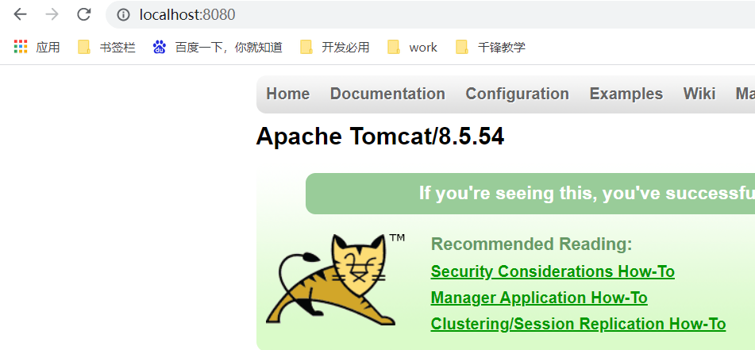

# 一、软件架构

## 1、C/S

### 1.1 意思

- Client/Server：客户端/服务器

### 1.2 例如

- QQ、微信、王者荣耀.......

### 1.3 特征

- 缺点

> 1. 必须在本地安装一个客户端软件
> 2. 如果版本升级了，那么本地客户端必须更新后才能享受新功能

- 优点

> 1. 画面非常酷炫
> 2. 而且游戏很少出现卡顿

## 2、B/S

### 1.1 意思

- Brower/Server：浏览器【客户端】/服务器

### 1.2 例如

- 百度、淘宝、新浪、CSDN、菜鸟教程、世纪佳缘，网页游戏.......

### 1.3 特征

- 缺点

> 1. 如果是网页游戏，会出现地图突然间没了，一会又出现这种情况

- 优点

> 1. 不用在本地安装独立的客户端，只需要安装一个浏览器即可
> 2. 应用更新了，本地无需做任何操作，照样直接访问服务器即可

## 3、Java一般市场就是专门开发B/S架构的系统

- PC端
- 手机端

==无论是开发PC端还是手机端应用，对于服务器来说，都没有任何区别==

# 二、服务器

## 1、概述

- 一个安装了特定软件(服务器软件)的电脑【这个电脑配置比较高，系统是Linux】

## 2、服务器软件

- tomcat
  - 版本：8.5.54
  - apache开源基金组织
  - 是一个中小型开源的服务器软件
  - 支持核心JavaEE开发规范(接口)【Servlet、JSP】

## 3、JavaWEB

- WEB：泛指网站，就是提供资源访问【资源：数据，是指网站所有的东西】
- WEB服务器：能够部署运行WEB应用的服务器软件 ---- tomcat
- JavaWEB：用Java开发WEB应用

# 三、Tomcat安装

## 1、安装及运行

> 1. 下载：https://tomcat.apache.org/download-80.cgi
> 2. 解压
>    - 解压到纯英文目录
> 3. 启动
>    - 双击 tomcat/bin/startup.bat
> 4. 测试
>    - 浏览器输入http://localhost:8080，回车看到一只猫就证明成功了

| http://localhost:8080                                        |
| ------------------------------------------------------------ |
|  |

## 2、启动失败

- 启动时，窗口一闪而过

  - 原因是因为没有正确配置环境变量JAVA_HOME

  - 解决方案：正确配置环境变量JAVA_HOME

| 配置环境变量JAVA_HOME                                        |
| ------------------------------------------------------------ |
|  |

## 3、停止tomcat

- 点击黑窗口叉【强制关闭，不推荐】
- 双击 tomcat/bin/shutdown.bat 【正常关闭，推荐】

