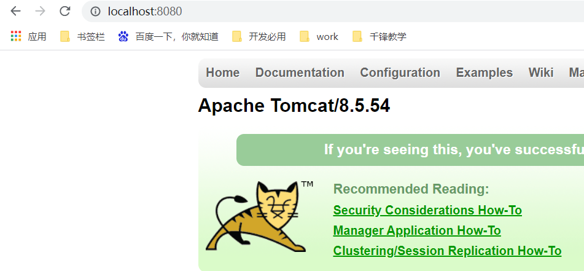
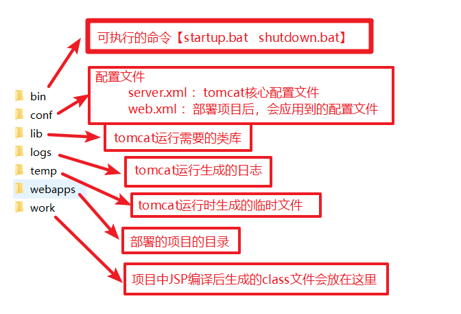

# 一、软件架构

## 1、C/S

### 1.1 意思

- Client/Server：客户端/服务器

### 1.2 例如

- QQ、微信、王者荣耀.......

### 1.3 特征

- 缺点

> 1. 必须在本地安装一个客户端软件
> 2. 如果版本升级了，那么本地客户端必须更新后才能享受新功能

- 优点

> 1. 画面非常酷炫
> 2. 而且游戏很少出现卡顿

## 2、B/S

### 1.1 意思

- Brower/Server：浏览器【客户端】/服务器

### 1.2 例如

- 百度、淘宝、新浪、CSDN、菜鸟教程、世纪佳缘，网页游戏.......

### 1.3 特征

- 缺点

> 1. 如果是网页游戏，会出现地图突然间没了，一会又出现这种情况

- 优点

> 1. 不用在本地安装独立的客户端，只需要安装一个浏览器即可
> 2. 应用更新了，本地无需做任何操作，照样直接访问服务器即可

## 3、Java一般市场就是专门开发B/S架构的系统

- PC端
- 手机端

==无论是开发PC端还是手机端应用，对于服务器来说，都没有任何区别==

# 二、服务器

## 1、概述

- 一个安装了特定软件(服务器软件)的电脑【这个电脑配置比较高，系统是Linux】

## 2、服务器软件

- tomcat
  - 版本：8.5.54
  - apache开源基金组织
  - 是一个中小型开源的服务器软件
  - 支持核心JavaEE开发规范(接口)【Servlet、JSP】

## 3、JavaWEB

- WEB：泛指网站，就是提供资源访问【资源：数据，是指网站所有的东西】
- WEB服务器：能够部署运行WEB应用的服务器软件 ---- tomcat
- JavaWEB：用Java开发WEB应用

# 三、Tomcat安装

## 1、安装及运行

> 1. 下载：https://tomcat.apache.org/download-80.cgi
> 2. 解压
>    - 解压到纯英文目录
> 3. 启动
>    - 双击 tomcat/bin/startup.bat
> 4. 测试
>    - 浏览器输入http://localhost:8080，回车看到一只猫就证明成功了
>      - http://localhost:8080 ：是一个URL地址【统一资源定位符】
>        - http：协议
>        - localhost：主机名或者ip地址【ip：127.0.0.1】
>        - 8080：端口号
>        - 没有输入资源地址，默认访问的是 index.jsp 这个资源

| http://localhost:8080                                        |
| ------------------------------------------------------------ |
|  |

## 2、启动失败

- 启动时，窗口一闪而过

  - 原因是因为没有正确配置环境变量JAVA_HOME

  - 解决方案：正确配置环境变量JAVA_HOME

| 配置环境变量JAVA_HOME                                        |
| ------------------------------------------------------------ |
|  |

## 3、停止tomcat

- 点击黑窗口叉【强制关闭，不推荐】
- 双击 tomcat/bin/shutdown.bat 【正常关闭，推荐】

## 4、Tomcat的目录结构

| Tomcat的目录结构                                             |
| ------------------------------------------------------------ |
|  |

# 四、创建WEB项目

## 1、idea集成tomcat

| settings                                                     |
| ------------------------------------------------------------ |
|  |
|  |

## 2、创建一个WEB项目

| 创建一个WEB项目                                              |
| ------------------------------------------------------------ |
|  |

## 3、WEB项目的目录结构

| WEB项目的目录结构                                            |
| ------------------------------------------------------------ |
|  |

## 4、如何启动一个WEB项目

- 部署

|                                                              |
| ------------------------------------------------------------ |
|  |
|  |

- 如何访问

| 项目虚拟路径                                                 |
| ------------------------------------------------------------ |
|  |

| tomcat配置页面                                               |
| ------------------------------------------------------------ |
|  |
|  |

| tomcat真正访问的资源                                         |
| ------------------------------------------------------------ |
|  |

# 五、Servlet

## 1、概述

详细介绍：https://www.runoob.com/servlet/servlet-intro.html

- 就是一个服务器上运行小程序，本质上是JavaEE开发的一种规范【就是一个接口】
  - 凡是只有通过服务器上才能访问的资源被称为动态资源

## 2、服务器上资源

- 分类
  - 静态资源：就是不同的人访问，得到结果是相同的。
    - html、css、js
  - 动态资源：就是不同的人访问，得到结果有可能是不同的。
    - Servlet、JSP

## 3、快速入门

### 3.1 实现步骤

> 1. 创建一个web项目
> 2. 编写一个类，实现Servlet接口
> 3. 重写抽象方法，在Service方法中输出一句话
> 4. 在web.xml中配置和映射Servlet
> 5. 启动tomcat，在浏览器上输入url地址【通过 url-pattern 这个标签的配置】访问Servlet
>    - 在控制台看到输出的话就代表成功了

### 3.2 执行流程

| 执行流程                                                     |
| ------------------------------------------------------------ |
|  |
|  |

## 4、Servlet生命周期

### 4.1 默认生命周期

> 1. tomcat启动时，会加载web.xml配置文件
> 2. 第一次访问Servlet时
>    - tomcat通过反射调用无参构造器创建Servlet实例
>    - tomcat调用init方法初始化Servlet信息
>    - tomcat调用service来处理请求
> 3. 第二次及以后每次访问都只会调用service方法
> 4. tomcat正常停止前一刻，调用destroy方法销毁Servlet实例

### 4.2 Servlet是线程安全的吗？

- Servlet是单例的，是线程非安全的

### 4.3 如何保证Servlet的线程安全？

- 上锁：效率太低
- ThreadLocal
- 不要在Servlet使用成员变量，即便使用成员变量，也不要对它进行修改【推荐】

## 5、能不能改变生命周期？

| load-on-startup ：可以指定Servlet的初始化时机                |
| ------------------------------------------------------------ |
|  |

### 6、url-pattern这个标签有哪些配置方式

| 两种                                                         |
| ------------------------------------------------------------ |
|  |

# 六、HTTP

## 1、概述

- 超文本传输协议（HTTP，HyperText Transfer Protocol)是互联网上应用最为广泛的一种网络协议，

- 是一个==基于请求与响应模式==的

- ==无状态==：每次发送请求到服务器，请求都是一个新的

- 应用层的协议，运行于TCP协议基础之上。

  | http://ip:端口/虚拟目录/资源路径     |
  | ------------------------------------ |
  | ip：主机ip                           |
  | 端口：服务器软件端口                 |
  | 虚拟目录：JavaWeb项目访问地址        |
  | 资源路径：Servlet路径（URL pattern） |

## 2、特点

- 基于请求与响应【适用于浏览器（客户端）与服务器】，且请求与响应是一对一的关系
- 无状态：每次发送请求到服务器，请求都是一个新的
- 版本1.1：持续连接机制
- HTTP允许传输任意类型的数据，传输的数据类型由Content-Type标识

## 3、HTTP通信

- 三次握手
  - ack机制：确保客户端与服务器是能够正常通信的
- 四次挥手
  - ack机制：确保服务器在断开客户端连接时，服务器端完成数据的传输，同意客户端断开连接请求

> 是基于ACK机制【确认机制】

## 4、请求报文和响应报文

- 请求报文
  - 请求行 请求方式/请求URL地址 HTTP/1.1
  - 请求头(Request Header)
  - 请求空行
  - 请求正文【只有POST请求方式才有】
- 响应报文
  - 状态行
  - 响应头(Response Header)
  - 响应空行
  - 响应正文

## 5、响应状态码

- 2开头的：响应成功【200】
- 3开头的
  - 缓存【304】
  - 重定向【302】
- 4开头的：客户端错误
  - 找不到资源【404】    
  - 请求方式不对【405】     
  - 请求参数错误【400】
  - 未认证【401】
  - 权限不足【403】
- 5开头的
  - 服务器错误【500，服务器出异常了（你代码写出错了）】
- 6开头的【没人用】

| 状态码大全                                                   |
| ------------------------------------------------------------ |
|  |

# 七、Servlet高级

## 1、Servlet继承体系

- Servlet   -------   接口
  - GenericServlet   -------    抽象类
    - HttpServlet     ------    抽象类

## 2、Servlet三种创建方式

- 实现Servlet接口
- 继承GenericServlet，重写service方法
- 继承HttpServlet，重写 doGet方法 和 doPost方法

### 2.1 HTTP请求方式

- http请求有7种请求方式，目前浏览器只支持GET和POST，如果没有特殊指定，默认就是GET请求

### 2.2 Servlet接口的init方法

| web.xml                                                      |
| ------------------------------------------------------------ |
|  |

| Demo01Servlet.java                                           |
| ------------------------------------------------------------ |
|  |

