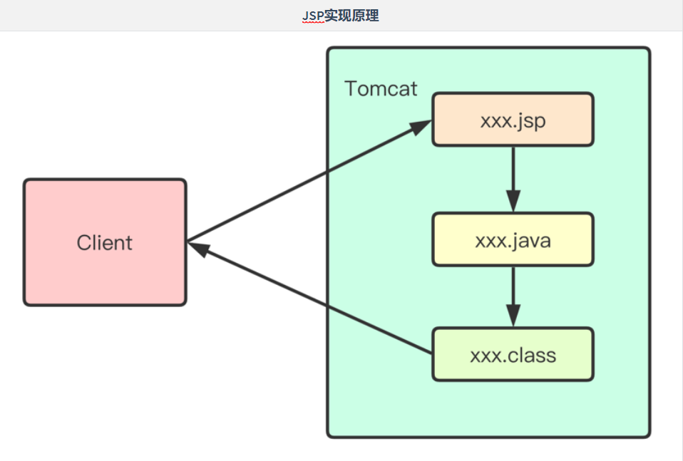

# Day 46笔记

## 一、过滤器(重点)

### 1.1 概述

* 多个Servlet中可能出现很多相同的代码，出现代码重复、冗余的情况
* 可以把多个Servlet中这样的代码提取出来做成一个过滤器

### 1.2 工作原理


### 1.3 创建过滤器

* 编写类，实现Filter接口重写其中的3个方法
  * init
    * 初始化，服务器启动之后马上执行
    * 执行一次
  * doFilter
    * 执行过滤的操作
    * 可以执行多次
  * destroy
    * 销毁，服务器关闭时执行

### 1.4 字符编码过滤器

```java
package com.qf.filters;

import javax.servlet.*;
import javax.servlet.annotation.WebFilter;
import javax.servlet.http.HttpServletRequest;
import javax.servlet.http.HttpServletResponse;
import java.io.IOException;

@WebFilter("/*")
public class EncodingFilter implements Filter {

    public void init(FilterConfig config) throws ServletException {
        System.out.println("字符集过滤器初始化...");
    }

    public void doFilter(ServletRequest req, ServletResponse resp, FilterChain chain) throws ServletException, IOException {
        System.out.println("字符集过滤器工作ing...");

        // 字符编码设置
        HttpServletRequest request = (HttpServletRequest) req;
        HttpServletResponse response = (HttpServletResponse) resp;

        request.setCharacterEncoding("UTF-8");
        response.setContentType("text/html;charset=utf-8");

        chain.doFilter(request, response);
    }

    public void destroy() {
        System.out.println("字符集过滤器销毁...");
    }
}
```

### 1.5 过滤器配置

* 注解配置

  * 和Servlet配置方式大致相同
  * value是需要过滤的对象

* web.xml配置

  ```
  <!--过滤器的xml配置  -->
    <filter>
    <!--名称-->
      <filter-name>sf</filter-name>
      <!--过滤器类全称-->
      <filter-class>com.qf.web.filter.SecondFilter</filter-class>
    </filter>
   <!--映射路径配置-->
    <filter-mapping>
       <!--名称-->
      <filter-name>sf</filter-name>
       <!--过滤的url匹配规则和Servlet类似-->
      <url-pattern>/*</url-pattern>
    </filter-mapping>
  ```

  

### 1.6 过滤器优先级

* 注解配置
  * 谁的字节码文件靠前就先执行
* web.xml配置
  * 根据配置文件中配置信息的先后顺序执行

### 1.7 过滤器路径配置方式

```
过滤器的过滤路径通常有三种形式:

精确过滤匹配 ，比如/index.jsp   /myservlet1

后缀过滤匹配，比如*.jsp、*.html、*.jpg

通配符过滤匹配/*，表示拦截所有。注意过滤器不能使用/匹配。
	/aaa/bbb/* 允许
按照模块匹配
/manager/*
/employee/*
```

### 1.8 过滤器案例

* 前端login.jsp
  * 发起登录请求

```jsp
<%--
  Created by IntelliJ IDEA.
  User: Dushine2008
  Date: 2021/6/21
  Time: 10:11
  To change this template use File | Settings | File Templates.
--%>
<%@ page contentType="text/html;charset=UTF-8" language="java" %>
<html>
    <head>
        <title>会员登录</title>
    </head>
    <body>
        <form action="login" method="get">
            用户名:
            <input type="text" name="username">
            <br>

            密码:
            <input type="password" name="password">
            <br>

            <input type="submit" value="登录">
        </form>
    </body>
</html>
```


* 服务端--LoginServlet
  * 接收请求
    * 收参
  * 处理请求
    * 验证--使用假数据
    * 把Login的状态记录下来
  * 响应
    * 返回前端结果

```java
package com.qf.servlets;

import javax.servlet.ServletException;
import javax.servlet.annotation.WebServlet;
import javax.servlet.http.HttpServlet;
import javax.servlet.http.HttpServletRequest;
import javax.servlet.http.HttpServletResponse;
import java.io.IOException;

@WebServlet("/login")
public class LoginServlet extends HttpServlet {
    protected void doPost(HttpServletRequest request, HttpServletResponse response) throws ServletException, IOException {
        doGet(request,response);
    }

    protected void doGet(HttpServletRequest request, HttpServletResponse response) throws ServletException, IOException {
        System.out.println("登录验证...");

        // 收参
        String username = request.getParameter("username");
        String password = request.getParameter("password");

        // 验证
        if (username.equals("zhangsan") && password.equals("666")){
            System.out.println("登录成功...");
            // 记录登录状态
            request.getSession().setAttribute("loginUser",true);
            response.sendRedirect(request.getContextPath() + "/index.jsp");

        }else{
            System.out.println("登录失败...");
        }
    }
}
```

* 过滤器
  * 获取登录状态信息
    * 如果登录--》主页
    * 如果未登录--》登录页

```java
package com.qf.filters;

import javax.servlet.*;
import javax.servlet.annotation.WebFilter;
import javax.servlet.http.HttpServletRequest;
import javax.servlet.http.HttpServletResponse;
import java.io.IOException;

@WebFilter("/index.jsp")
public class ALoginFilter implements Filter {
    public void destroy() {
    }

    public void doFilter(ServletRequest req, ServletResponse resp, FilterChain chain) throws ServletException, IOException {
        System.out.println("登录主页验证");

        // 类型转换
        HttpServletRequest request = (HttpServletRequest) req;
        HttpServletResponse response = (HttpServletResponse) resp;

        // 获取存入的用户状态
        Object loginUser = request.getSession().getAttribute("loginUser");

        if (loginUser != null){
            chain.doFilter(req, resp);
        }else {
            System.out.println("还没有登录过，请先去登录");
            response.sendRedirect(request.getContextPath() + "/login.jsp");
        }


    }

    public void init(FilterConfig config) throws ServletException {

    }

}
```

## 二、AJAX（重点）

### 2.1 概述

* AJAX = Asynchronous JavaScript and XML（异步的 JavaScript 和 XML）。
* AJAX 不是新的编程语言，而是一种使用现有标准的新方法。
* AJAX 是与服务器交换数据并更新部分网页的技术，在不重新加载整个页面的情况下。
* XMLHttpRequest（XHR）对象用于与服务器交互。通过 XMLHttpRequest 可以在不刷新页面的情况下请求特定 URL，获取数据。这允许网页在不影响用户操作的情况下，更新页面的局部内容。所以XMLHttpRequest对象是Ajax技术的核心所在。 

### 2.2 JavaScript的AJAX请求--get方式

* 前端

```jap
<%@ page contentType="text/html;charset=UTF-8" language="java" %>
<html>
	<head>
		<meta charset="utf-8">
		<title>用户注册</title>
	</head>
	<body>
		<form action="register" method="get">
			用户名:
			<input type="text" id="username" name="username" value="" onblur="checkName()" />
			<span id="username-notice">

			</span>
			<br>

			密码:
			<input type="password" name="password" />
			<br>

			<input type="submit" value="注册" />
		</form>
	</body>
	<script type="text/javascript">
		/**
		 * 用户名输入框失去焦点的时候检查用户名是否可用
		 */
		function checkName() {
			// 第一步：创建一个xhr对象(你可以称呼它为小黄人)
			var xhr = new XMLHttpRequest();
			
			// 第二步：打开请求地址，初始化数据，使用get方式,请求到URL(register的Servlet，携带用户名输入框中的数据),第三个参数中使用了true，该参数规定请求是否异步处理，默认是异步。true表示脚本会在send()方法之后继续执行，而不等待来自服务器的响应。
			xhr.open("GET", "register?username=" 		+document.getElementById("username").value, true);
			// 第三步：发送请求数据
			xhr.send();
			// 第四步：监听回调函数状态
			xhr.onreadystatechange = function() {
				if (xhr.readyState == 4 && xhr.status == 200) {
					// 当状态码为4并且响应码为200的时候--响应成功--修改提示框中的显示内容
					document.getElementById("username-notice").innerHTML = xhr.responseText;
				}
			}

			
		}
	</script>
</html>
```

* 后端

```java
package com.qf.servlets;

import javax.servlet.ServletException;
import javax.servlet.annotation.WebServlet;
import javax.servlet.http.HttpServlet;
import javax.servlet.http.HttpServletRequest;
import javax.servlet.http.HttpServletResponse;
import java.io.IOException;

@WebServlet("/register")
public class RegisterServlet extends HttpServlet {
    protected void doPost(HttpServletRequest request, HttpServletResponse response) throws ServletException, IOException {
        doGet(request,response);
    }

    protected void doGet(HttpServletRequest request, HttpServletResponse response) throws ServletException, IOException {
        // 收参
        String username = request.getParameter("username");

        /**
         * 验证username是否被占用
         *  应该去数据库查询username是否存在
         *  select * from user where username=username
         */

        if (username.equals("zhangsan")){
            // 用户名被占用
            response.getWriter().write("用户名被占用");
        } else{
            response.getWriter().write("用户名可用");
        }
    }
}
```

### 2.3 JavaScript的AJAX请求--post方式

```jsp
<%@ page contentType="text/html;charset=UTF-8" language="java" %>
<html>
	<head>
		<meta charset="utf-8">
		<title>用户注册</title>
	</head>
	<body>
		<form action="register" method="get">
			用户名:
			<input type="text" id="username" name="username" value="" onblur="checkName()" />
			<span id="username-notice">

			</span>
			<br>

			密码:
			<input type="password" name="password" />
			<br>

			<input type="submit" value="注册" />
		</form>
	</body>
	<script type="text/javascript">
		/**
		 * 用户名输入框失去焦点的时候检查用户名是否可用
		 */
		function checkName() {
			// 创建请求对象
			var xhr = new XMLHttpRequest();
			
			// 使用get方式,请求到register的Servlet，携带用户名输入框中的数据
			xhr.open("post", "register", true);
			// 设置请求头
			xhr.setRequestHeader("Content-type","application/x-www-form-urlencoded");

			// 发送请求
			xhr.send("username=" + document.getElementById("username").value);
            // 监听回调函数状态
            xhr.onreadystatechange = function() {
				if (xhr.readyState == 4 && xhr.status == 200) {
					// 当状态码为4并且响应码为200的时候--响应成功--修改提示框中的显示内容
					document.getElementById("username-notice").innerHTML = xhr.responseText;
				}
			}
		}
	</script>
</html>
```

### 2.4 JQuery的get请求

```jsp
<%--
  Created by IntelliJ IDEA.
  User: Dushine2008
  Date: 2021/6/21
  Time: 11:23
  To change this template use File | Settings | File Templates.
--%>
<%@ page contentType="text/html;charset=UTF-8" language="java" %>
<html>
<head>
    <meta charset="utf-8">
    <title>用户注册</title>
    <script src="js/jquery-3.6.0.min.js" type="text/javascript" charset="utf-8"></script>
</head>
<body>
<form action="register" method="get">
    用户名:
    <input type="text" id="username" name="username" value="" onblur="checkName()" />
    <span id="username-notice">

	</span>
    <br>

    密码:
    <input type="password" name="password" />
    <br>

    <input type="submit" value="注册" />
</form>
</body>
<script type="text/javascript">
    /**
     * 用户名输入框失去焦点的时候检查用户名是否可用
     */
    function checkName() {
        var $username = $("#username").val();
        /*$.get({
            url: "register?username=" + $username,
            success:function (data) {
                $("#username-notice").html(data);
            }
        });*/

        $.get("register?username=" + $username,function (data) {
                $("#username-notice").html(data);
            }
        )
    }
</script>
</html>
```

## 三、JSP（熟练）

### 3.1 概述

```
在之前学习Servlet时，服务端通过Servlet响应客户端页面，有什么不足之处？

- 开发方式麻烦：继承父类、覆盖方法、配置Web.xml或注解
- 代码修改麻烦：重新编译、部署、重启服务
- 显示方式麻烦：获取流、使用println("");逐行打印
- 协同开发麻烦：UI负责美化页面，程序员负责编写代码。UI不懂Java，程序员又不能将所有前端页面的内容通过流输出
```

### 3.2 什么是JSP

```
简化的Servlet设计，在HTML标签中嵌套Java代码，用以高效开发Web应用的动态网页
java Server pages
```

### 3.3 作用

```
替换显示页面部分的Servlet(使用*.jsp文件替换XxxJSP.java)
```

### 3.4 创建jsp文件

* 右键单击web，在此处创建jsp文件
* 也可以是web中的目录

### 3.5 访问jsp文件

* http://localhost:8080/Day46_war_exploded/user/demo02.jsp

### 3.7 jsp和Servlet


### 3.8 jsp工作原理



## 四、JSP语法

### 4.1 普通脚本和声明脚本

* 普通脚本
  * java输出代码
  * java运算
  * java变量定义
  * 不能写函数
* 声明脚本
  * 声明变量
  * 声明方法

```jsp
<%@ page import="java.util.Random" %><%--
  Created by IntelliJ IDEA.
  User: Dushine2008
  Date: 2021/6/21
  Time: 14:52
  To change this template use File | Settings | File Templates.
--%>
<%@ page contentType="text/html;charset=UTF-8" language="java" %>
<html>
    <head>
        <title>jsp脚本语法</title>
    </head>
    <body>
        <%
            out.println("Hello Jsp！！！");
            out.println("<br>");
            out.println("Hello Jsp！！！");
        %>

        <br>

        <%
            out.println("Hello Jsp!!!");
        %>

        <br />

        <%
            int num = 123;
            out.println("num = " + num);
        %>
        <br>

        <%
            out.println("num = " + num);
        %>

        <%--
            声明脚本
                可以定义变量和函数
            --%>
        <%!
            int a = 10;
            int b = 20;

            public int getNum(int bound){
                return new Random().nextInt(bound);
            }
        %>

        <%
            out.println("a + b = " + (a + b));
        %>

        <br>

        <%
            out.println(getNum(10));
        %>


    </body>
</html>
```

### 4.2 输出脚本

* 经验：输出脚本可以输出带有返回值的函数]()
* [注意：输出脚本中不能加 ; ]()

```
<%--
  Created by IntelliJ IDEA.
  User: Dushine2008
  Date: 2021/6/21
  Time: 15:19
  To change this template use File | Settings | File Templates.
--%>
<%@ page contentType="text/html;charset=UTF-8" language="java" %>
<html>
    <head>
        <title>输出脚本</title>
    </head>
    <body>

        <%
            int a = 110;
        %>

        <%
            int b = 220;
        %>

        <%=
            3.1415926
        %>

        <br>

        <%=
            "a = " + a
        %>

        <br>

        <%=
            a+b
        %>

        <%!
            public int getSum(int a,int b){
                return a+b;
            }
        %>

        <%--    输出脚本    --%>
        <%=
            getSum(a,b)
        %>

    </body>
</html>
```

### 4.3 Jsp指令

#### page指令

```
- 语法：<%@ page attribute1="value1" attribute2="value2" %>
- Page指令为容器提供当前页面的使用说明。一个JSP页面可以包含多个page指令。
```

​	

```jsp
<%@ page contentType="text/html;charset=UTF-8" language="java" errorPage="error.jsp" session="true" %>
<html>
    <head>
        <title>page指令</title>
    </head>
    <body>
        <%
            out.println(10/0);
        %>
    </body>
</html>
```

#### userBean指令

#### setProperty

#### getProperty

```jsp
<%--
  Created by IntelliJ IDEA.
  User: Dushine2008
  Date: 2021/6/21
  Time: 15:37
  To change this template use File | Settings | File Templates.
--%>
<%@ page contentType="text/html;charset=UTF-8" language="java" %>
<html>
    <head>
        <title>userBean</title>
    </head>
    <body>
        <%--    相当于java中创建User对象    --%>
        <jsp:useBean id="user" class="com.qf.entity.User"></jsp:useBean>

        <%--    相当于java中属性赋值    --%>
        <jsp:setProperty name="user" property="username" value="zhangsan"></jsp:setProperty>
        <jsp:setProperty name="user" property="password" value="sanzhang"></jsp:setProperty>

        <jsp:getProperty name="user" property="username"/>
        <br>
        <jsp:getProperty name="user" property="password"/>
        <br>

        <%=
            user
        %>
        <br>

        <%=
            user.getUsername() + "===" + user.getPassword()
        %>
    </body>
</html>
```

#### forward

#### param

```jsp
<%--
  Created by IntelliJ IDEA.
  User: Dushine2008
  Date: 2021/6/21
  Time: 15:37
  To change this template use File | Settings | File Templates.
--%>
<%@ page contentType="text/html;charset=UTF-8" language="java" %>
<html>
    <head>
        <title>userBean</title>
    </head>
    <body>
        <%--    相当于java中创建User对象    --%>
        <jsp:useBean id="user" class="com.qf.entity.User"></jsp:useBean>

        <%--    相当于java中属性赋值    --%>
        <jsp:setProperty name="user" property="username" value="zhangsan"></jsp:setProperty>
        <jsp:setProperty name="user" property="password" value="sanzhang"></jsp:setProperty>

        <jsp:getProperty name="user" property="username"/>
        <br>
        <jsp:getProperty name="user" property="password"/>
        <br>

        <%=
            user
        %>
        <br>

        <%=
            user.getUsername() + "===" + user.getPassword()
        %>

        <jsp:forward page="demo08.jsp">
            <jsp:param name="username" value="songjiang"/>
        </jsp:forward>
    </body>
</html>
```

## 五、内置对象

### 5.1 九大内置对象

* JSP内置，可以直接使用

| 对象名          | 类型                                   | 说明                        |
| --------------- | -------------------------------------- | --------------------------- |
| [request]()     | javax.servlet.http.HttpServletRequest  |                             |
| [response]()    | javax.servlet.http.HttpServletResponse |                             |
| [session]()     | javax.servlet.http.HttpSession         | 由session=“true”开关        |
| [application]() | javax.servlet.ServletContext           |                             |
| config          | javax.servlet.ServletConfig            |                             |
| exception       | java.lang.Throwable                    | 由isErrorPage=“false”开关   |
| out             | javax.servlet.jsp.JspWriter            | javax.servlet.jsp.JspWriter |
| [pageContext]() | javax.servlet.jsp.PageContext          |                             |
| page            | java.lang.Object当前对象this           | 当前servlet实例             |

### 5.2 四大域对象

* 存储数据、传递数据
* 存取数据发方式一样
* 作用范围和生命周期不同

```
- pageContext]() (javax.servlet.jsp.PageContext)  当前JSP页面范围
- [request]()  (javax.servlet.http.HttpServletRequest) 一次请求有效
- [session]()  (javax.servlet.http.HttpSession)  一次会话有效(关闭浏览器失效)
- [application]()  (javax.servlet.ServletContext)  整个Web应用有效(服务器重启或关闭失效)
```

### 5.3 pageContext

- pageContext对象是javax.servlet.jsp.PageContext 类的实例，拥有作用域，用来代表整个JSP页面。
- 当前页面的作用域对象，一旦跳转则失效
- 通过setAttribute("name",value);存储值
- 通过getAttribute("name");获取值
- 用于获取其他8个内置对象或者操作其他对象的作用域

### 5.4 域对象设置数据

```
<%--
  Created by IntelliJ IDEA.
  User: Dushine2008
  Date: 2021/6/21
  Time: 16:12
  To change this template use File | Settings | File Templates.
--%>
<%@ page contentType="text/html;charset=UTF-8" language="java" %>
<html>
    <head>
        <title>pageContext的find方法</title>
    </head>
    <body>
        <%
            pageContext.setAttribute("flag","pageContext设置的标记");
            request.setAttribute("flag","request设置的标记");
            session.setAttribute("flag","session设置的标记");
            application.setAttribute("flag","application设置的标记");
        %>

        <%--
            pageContext.findAttribute("flag")

            从四大作用域中查询flag对应的value
            从小到大寻找
            pageContext > request > session > application
        --%>
        <%=
           pageContext.findAttribute("flag")
        %>

        <%
            pageContext.setAttribute("name","pageContext设置的标记");//当前页面有效
            pageContext.setAttribute("name","request设置的标记",PageContext.REQUEST_SCOPE);//request作用域
            pageContext.setAttribute("name","session设置的标记",PageContext.SESSION_SCOPE);//session作用域
            pageContext.setAttribute("name","application设置的标记",PageContext.APPLICATION_SCOPE);//application作用域
        %>

        <br>
        <%=
            pageContext.getAttribute("name")
        %>
        <br>
        <%=
            pageContext.getAttribute("name",PageContext.REQUEST_SCOPE)
        %>
        <br>
        <%=
            pageContext.getAttribute("name",PageContext.SESSION_SCOPE)
        %>
        <br>
        <%=
            pageContext.getAttribute("name",PageContext.APPLICATION_SCOPE)
        %>

    </body>
</html>
```

